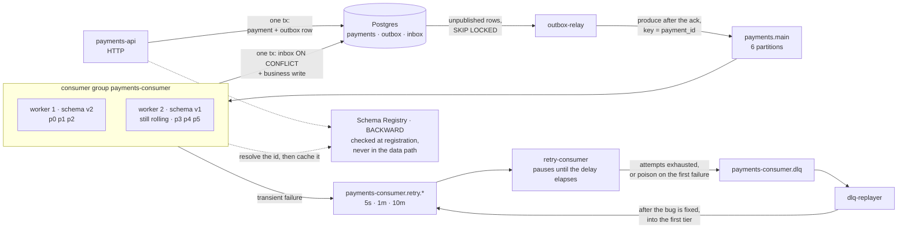

# Kafka-lab

A lab for **Apache Kafka in depth**: internals, delivery guarantees, and the operational
behaviour of a payments service built on them. Every claim in this repository is either
backed by a reproducible experiment (`make exp-NN`) with its numbers committed, or
marked `TBD` until that experiment has run.

**Status.** The diagrams and the internals documentation are in place, and so is the
cluster they describe: `make up` brings up three KRaft brokers, and the topics are
declared as YAML in [`deploy/topics/`](deploy/topics/) and applied with
[topicctl](https://github.com/segmentio/topicctl). The payments service described below has
started: the domain, the authorise use case, the Postgres side of it — schema, unit of work,
idempotent insert and the outbox — the outbox relay that publishes those events to Kafka as
Protobuf through the schema registry, and the consumer that reads them back, deduplicates
them through an inbox and keeps a per-merchant projection. The HTTP layer is in front of it
now, so the whole path runs end to end: a POST creates a payment, the relay publishes it,
the consumer counts it, and a GET reads the total back. The retry topics in the catalog are
still unused; the diagram is labelled accordingly rather than quietly implying otherwise.

| KR (PDP) | Deliverable | Where it lives | State |
|---|---|---|---|
| Fundamentals and internals | cheat sheet with write and read path diagrams | [`docs/static/`](docs/static/) — index plus cases 01–04 | diagrams done; exp-01…04 measured — a key is worth 6 827 – 8 721 ordering violations per 10 000 events over seven runs; a skewed key leaves seven consumers no faster than one by more than run-to-run variance, the seventh idle; compaction turned 2 010 records into 50; a killed broker is noticed within about ten seconds and never gives its leadership back, and raising `broker.session.timeout.ms` to 20 s moves that to 20.3 s while the lag timer everyone quotes stays put. Cases 01 and 03 are filled in; `TBD` rows remain in case 02 (exp-03b/c/d), and case 09's matrix is measured except for the two field-reuse cells, case 02 lists three things exp-03 did not show, and case 04 lists exp-04b as blocked on this stand |
| Delivery guarantees and tuning | notes on semantics plus a tuning checklist | cases 05, 08, 10; [`docs/tuning-checklist.md`](docs/tuning-checklist.md) | mechanics and checklist written; exp-05/06/07 measured — the same crash loses 49 payments, charges 50 twice, or costs nothing, depending on where one line sits; exp-08 measured — `acks=all` with `min.insync.replicas=3` refused all 2 000 writes once a broker died, while `acks=1`, with the followers paused to hold the replication window open, lost all 2 000 records it had acknowledged; exp-09 measured — with idempotence off franz-go reordered nothing in three runs and duplicated 80–291 events, in the one run that counted retries every duplicate was a record the leader appended before answering `REQUEST_TIMED_OUT`, which the idempotent producer's broker dropped; exp-10 measured — a Kafka transaction rolled a crashed batch back exactly, left 50 Postgres rows duplicated beside it, and one stuck transaction hid an unrelated producer's records for 23.2 s; exp-05b/06b measured — franz-go's default autocommit is at-least-once and its greedy flavour loses the unwritten rest of a batch; exp-14 measured — eager revoked every partition for 39–75 ms, cooperative only the three that moved, for 0.52–0.68 s, and KIP-848 for 4.9–6.5 s, around its 5 s heartbeat; exp-16 measured — through a dependency outage lag is the same whatever the handler does, but retrying inline got the member removed and its stale commit rewound the group, while pausing fetches kept it whole; exp-17 measured — compression ratio is set by batching, not by the codec, and Java's `linger.ms` default is 5 ms since Kafka 4.0, not the 0 every guide quotes; exp-17b measured — flat out, compression raised throughput 1.1–4.7× because bytes were the ceiling. `acks=all` at `min.insync.replicas=1` cannot be staged on three combined nodes |
| Production-shaped Go app | working repo, README, architecture diagram | [`internal/`](internal/), [`cmd/`](cmd/), [`proto/`](proto/), this file | domain, authorise use case, Postgres adapter (goose migrations, `WithinTx` as a closure, `CreateOrGet` deciding insert-or-replay inside one `INSERT … ON CONFLICT`, outbox claimed with `FOR UPDATE SKIP LOCKED`) and the outbox relay: Protobuf registered with Apicurio, records keyed by `payment_id`, published with `acks=all` and marked published only after the ack. Proven by `make test-integration` against the real stand: eight concurrent authorisations with one idempotency key store one payment and one event, a rollback takes the event with it, two relays never claim the same row, the schema refuses an amount of zero, and a consumer decodes what the publisher wrote by the schema id inside the record. The consumer side is written too: an inbox keyed by `event_id` makes a redelivered event count once, the merchant projection is added to by the database rather than read-modify-written in Go, and a record nobody can decode — or one the consumer refuses — is archived to the dead letter topic with its bytes and the reason, so the partition behind it keeps moving. The HTTP layer closes the loop: `POST /payments` behind a required API key with constant-time comparison, a bounded body, `Idempotency-Key` mandatory, and one table that turns every domain refusal into a status a caller can act on without learning anything about the inside. Exercised end to end on the stand by hand — the one result here with no `make exp-NN` behind it, recorded in [the journal](docs/00-journal.md) rather than in a `results/` log: 201, then 200 on the retry, 409 on the key reused for another amount, 401 without the key, and `GET /merchants/m-e2e/total` returning 1999 after the relay and the consumer had done their work. The retry topics are outstanding |
| Operate, observe, stress | Compose, Grafana dashboard, failure report, runbook | [`deploy/`](deploy/), [`docs/failure-report.md`](docs/failure-report.md), [`docs/runbook.md`](docs/runbook.md) | three-broker Compose runs; exp-14 and exp-16 are measured under KR2; the metrics stack runs — Prometheus, Grafana with a provisioned dashboard, kafka-exporter, and the three services publishing backlog, sweep outcomes, handled-against-duplicate, dead letters by class and requests by route; exp-13 measured — at 10 payments/s not one was refused while brokers died underneath the relay, one broker down cost 88–91 records of backlog and two cost 469–523 with an 18–24 s catch-up, and the cluster reported itself perfectly healthy throughout because two dead controllers leave no quorum to update the metadata. exp-15 measured, in one run — a 60 MiB replication-factor change took 2.2 s unthrottled and 24.8 s at 1 MiB/s (a per-broker limit, not a cluster one, so the ~24 MiB landing on each broker is what sets the duration), with no measurable cost to producer latency either way on a stand this small; topicctl refuses the change outright, and `--verify` is what removes the throttle. The failure report and the runbook are written, and every line of both points at a run: which failures were produced on this stand and what each cost, what to check first during an incident and in what order, and which number lies — a green under-replicated panel is not a health check for a cluster that has lost its quorum |
| Patterns and anti-patterns | recommendations doc | [`docs/patterns.md`](docs/patterns.md) | written: every pattern points at a case file, every anti-pattern at the run where the damage is a number — ordering assumptions, hot partitions, retention, commit order, `acks=1`, idempotence off, blocking retries, open transactions, and now the poison pill: without a dead letter route exp-11 left 10 of 100 payments counted and 91 records unread behind one unreadable record, against all 100 in 207–322 ms with one. CDC, stream enrichment and the retry chain itself remain reasoned rather than measured; schema evolution no longer does — exp-12 found a new subject accepts every one of these breaking changes until a level is set on it, `FULL` accepts a field deletion that `BACKWARD` refuses, and a removed or retyped amount reaches the consumer as zero without any decoding error |
| Share findings | write-up or tech talk | [`docs/talk.md`](docs/talk.md), and the walkthroughs in [`docs/dynamic/`](docs/dynamic/) | written: seven claims everyone repeats, each against the number this stand produced when asked — a key is worth 6 827–8 721 ordering violations, one crash is 49 lost or 50 duplicated depending on one line, `acks=all` refuses 2 000 writes where `acks=1` loses them, the outbox accepted 303 payments while the cluster took none, a new subject checks nothing until it is configured, and one unreadable record left 91 payments unread. Plus the part that is not about Kafka: four of those runs were wrong the first time, all in the same way |

## Running the cluster

```
make up                          # brokers, Postgres, registry, and the metrics stack
make topics                      # create or update the catalog in deploy/topics
make check                       # non-zero exit on drift or on a cluster unfit to measure on
make describe TOPICS=payments.main
make lag GROUP=payments-consumer
make reset-topic TOPIC=payments-consumer.dlq
make elect-preferred             # move leadership back to the preferred replicas
make stop                        # pause, keeping the brokers' data
make down                        # stop and wipe the brokers' data
```

Topics are declared, not scripted: one YAML file per topic, applied by
[topicctl](https://github.com/segmentio/topicctl). The permanent catalog lives in
[`deploy/topics/`](deploy/topics/). An experiment's own topics — `min.insync.replicas=3`
for exp-08, a compacted one for exp-03 — live in `experiments/<group>/<exp>/topics/` and
are applied with `make exp-topics EXP=<group>/<exp>`, so they neither become part of the
catalog nor keep being checked after the experiment is over.

Every YAML states `min.insync.replicas` explicitly, and `make check` refuses to run
otherwise. With eligible leader replicas (KIP-966) the
controller keeps `min.insync.replicas` as a cluster-wide dynamic default — copied from the
broker setting, 2 here, when the cluster is first formatted — and topicctl would report
that inherited value as drift on every run of a YAML that leaves it out. Why every number
in the catalog is what it is, and which experiment gets a topic of its own, is written
down in [`deploy/topics/README.md`](deploy/topics/README.md).

`make check` is the step to run before every experiment. It fails on two kinds of problem.
**Drift**: a partition count or declared setting that no longer matches the YAML, and any
topic-level setting the YAML never declared. **Health**: replicas out of sync, throttles
left over from a reassignment, leaders off their preferred replica. The second kind matters
as much as the first — a measurement taken on a broker that leads four of six partitions
after the previous experiment is a number about that experiment, not about this one:

```
$ make check
  config settings correct | ✗ | 1 keys have different values between cluster and topic config: [cleanup.policy]
make: *** [check] Error 1
```

Because topicctl reads the replication factor off the in-sync replicas, a dead broker shows
up in `make check` as a failure too — which is the right answer before a measurement — and
`make topics` should only be run with all three brokers up.

Two behaviours of `topicctl apply` shape the rest. It **elects the preferred leader** on
every topic it touches, and with `auto.leader.rebalance.enable=false` that is the only thing
that moves leadership back on its own — so `make topics` is never run in the middle of an experiment
that measures leadership, and `make elect-preferred` exists to do it deliberately. And it
**only warns** about a setting the YAML never declared, leaving it in place, so
`make reset-topic` is the way back: it drops the topic and recreates it from its own YAML,
resetting the log as well as the config, without touching any other topic. It refuses to
delete a topic no YAML declares.

Brokers are reachable from the host at `localhost:19092,29092,39092`, bound to loopback
only. There is no restart policy on purpose: an experiment that kills a broker needs it
to stay dead until the experiment brings it back. Several broker defaults are pinned in
the Compose file for the same reason — auto leader rebalance and the retention check both
run on 300 s timers that would otherwise decide an experiment's outcome instead of Kafka.

## Running the service

```
make up                          # brokers, Postgres, and the Apicurio schema registry
make migrate                     # apply the schema; services never migrate on boot
make proto                       # regenerate gen/ from proto/ after changing a schema
go run ./cmd/outbox-relay        # publish what the outbox holds, until SIGTERM
go run ./cmd/payments-consumer   # read the topic, deduplicate, keep merchant totals
PAYMENTS_API_KEY=... go run ./cmd/payments-api   # POST /payments, GET /merchants/{id}/total
```

`make up` also brings up Prometheus on `localhost:9090`, Grafana on `localhost:3000` with
the dashboard already provisioned, and a kafka-exporter on `9308` that reads consumer group
lag and partition health from the cluster rather than from the services — a consumer that
has stopped cannot report its own lag, and that is exactly when the number matters. Grafana
has no login on purpose: a dashboard on loopback that asks for a password is a dashboard
nobody opens during the incident it was built for. Prometheus scrapes every 5 s, because
these experiments measure the seconds after a broker dies and the usual 15 s would draw a
recovery as a straight line between two samples.

Each service serves its metrics on a listener of its own — the relay on `:9101`, the
consumer on `:9102`, the API on `:9103` — so a scrape can never take a connection a payment
needed. What they publish is what an operator reads during an incident:
`outbox_backlog_records` (grows while the broker is away, falls when the relay drains),
`outbox_sweeps_total{outcome}`, `payment_events_handled_total{outcome}` where a duplicate
is counted apart from a fresh event, `payment_events_dead_lettered_total{reason}`, and
`http_requests_total{route,status}` labelled by route pattern rather than path, because a
label built from merchant ids grows a new series per customer.

The API binds to loopback and requires `X-API-Key`; it refuses to start without
`PAYMENTS_API_KEY`, because a service that moves money should not have a mode where it
serves callers it cannot name. There is no TLS and one shared key — enough for a lab, not
for a network anyone else is on.

```
curl -X POST localhost:8081/payments -H "X-API-Key: $PAYMENTS_API_KEY" \
     -H 'Idempotency-Key: demo-1' -H 'Content-Type: application/json' \
     -d '{"merchant_id":"m-42","amount_minor":1999,"currency":"EUR"}'
curl localhost:8081/merchants/m-42/total -H "X-API-Key: $PAYMENTS_API_KEY"
```

The first POST answers 201, the same request again answers 200 with the same payment id,
and the same key with a different amount answers 409 rather than quietly returning the
earlier payment.

`go run` does not pass a signal on to the program it built, so stopping either of these with
`kill` on the `go run` process leaves the real one running — building first (`go build -o
/tmp/relay ./cmd/outbox-relay`) is the way to keep a stray service from quietly competing
for the same outbox rows as your tests. That is not hypothetical; see the journal.

The registry is at `localhost:8080`; the producer talks to its Confluent-compatible API at
`/apis/ccompat/v7`, which is the wire format the records carry — a magic byte, the schema
id, the message indexes, then the payload. It keeps its schemas in a database of its own
inside the lab Postgres, created by [`deploy/postgres/init/`](deploy/postgres/init/) when
that volume is first initialised; a Postgres volume that predates the registry needs
`CREATE DATABASE apicurio` once, because init scripts only run on an empty data directory.
Its `/system/info` calls itself "Apicurio Registry (In Memory)" whatever the storage is —
the log line `Using postgresql SQL storage` is the one that tells the truth.

## Running the service's tests

```
make verify                      # build, vet, lint, and the unit tests under -race
make test-integration            # the same, against the stand from make up
```

`make verify` needs nothing running: the use case is tested against a fake that stages its
writes and applies them only on commit, so a rollback is distinguishable from a write that
never happened, and the relay's own tests run the ticker inside `testing/synctest` with
`goleak` watching for a goroutine that outlived its context. What a fake cannot prove goes
to `make test-integration`, which talks to the compose stand and is skipped by a plain
`go test` through the `integration` build tag: `ON CONFLICT` under eight concurrent
authorisations of one idempotency key, the `CHECK` constraints as the last line of defence
under the domain, `FOR UPDATE SKIP LOCKED` handing each outbox row to exactly one relay,
and a consumer decoding a published record through the registry — key, headers and all.
Each of those runs against a topic of its own, created and deleted by the test, so nothing
lands in the topics the experiments count.

## Target architecture



*Fig. — the bottom row is the write path and the top row is the consume path, and every
solid arrow between them is a boundary where atomicity ends: the API writes state and
event in one transaction and never calls the broker, the consumer writes the inbox row and
the business row in one transaction and never sleeps, and everything in between is
retryable delivery. The two dotted edges are the only ones that are not per record — the
registry is consulted when a schema is registered and once per unseen id, never in the
data path. The group is drawn mid-deploy, one worker on each schema version, because that
is the only state in which compatibility means anything
([09](docs/static/09-schema-evolution.md)).*

| Component | What it guarantees | Detail |
|---|---|---|
| `payments-api` | the payment and its event are written atomically, or neither is | [06](docs/static/06-transactional-outbox.md) |
| `outbox-relay` | an unavailable broker becomes a backlog, never a lost event or a failed request | [06](docs/static/06-transactional-outbox.md) |
| `payments.main` | ordering per `payment_id`, parallelism capped by partition count | [01](docs/static/01-write-path.md), [03](docs/static/03-read-path.md) |
| `payments-consumer` | a redelivered record changes nothing on the second pass | [05](docs/static/05-delivery-semantics.md) |
| `payments-consumer.retry.*` | a failing record waits without blocking the partition it came from; the chain belongs to the group, so a second group on `payments.main` gets its own | [07](docs/static/07-retry-dlq.md) |
| `payments-consumer.dlq` | a dead letter carries enough context to be replayed, not just logged, and is kept 30 days — long enough to fix, release and replay | [07](docs/static/07-retry-dlq.md) |
| Schema Registry | an incompatible schema is rejected at registration, not discovered at read. The registry is never in the data path: the producer encodes a schema id into the bytes, and each consumer resolves that id once and caches it | [09](docs/static/09-schema-evolution.md) |

Two things this diagram deliberately does **not** contain: a `kafka.Publish()` call
inside the use case, and a `time.Sleep` inside the main consumer. Both are the obvious
implementation, and both are why the two patterns above exist.

## Documentation

**[`docs/static/`](docs/static/)** — the deliverable, and the cheat sheet: it opens with
a one-screen summary of the internals, then one case per file, rendered by GitHub without
running anything. Where a case is a comparison — where the message is lost, which
assignor, which deploy order — the file draws every side of it, because the argument is
the difference between two pictures.

| # | Case | The question it answers | Interactive |
|---|---|---|---|
| [01](docs/static/01-write-path.md) | Write path | What must happen before `Produce` returns success? | [yes](docs/dynamic/write-path/) |
| [02](docs/static/02-log-segments-retention.md) | The log on disk | What is stored, and which "current offset" is meant? | — |
| [03](docs/static/03-read-path.md) | Read path | How does a consumer get a partition and a starting offset? | [yes](docs/dynamic/read-path/) |
| [04](docs/static/04-isr-leader-election.md) | ISR and leader election | What makes an acknowledged record disappear? | — |
| [05](docs/static/05-delivery-semantics.md) | Delivery semantics | Where exactly is a message lost or duplicated? | [yes](docs/dynamic/lost-message/) |
| [06](docs/static/06-transactional-outbox.md) | Transactional outbox | Where does atomicity end between Postgres and Kafka? | [yes](docs/dynamic/outbox/) |
| [07](docs/static/07-retry-dlq.md) | Retry chain and DLQ | Where does a failing message wait, and who is blocked? | [yes](docs/dynamic/retry-dlq/) |
| [08](docs/static/08-rebalance.md) | Eager vs cooperative rebalance | How long does the group stop processing? | [yes](docs/dynamic/rebalance/) |
| [09](docs/static/09-schema-evolution.md) | Schema evolution | Who gets upgraded first, producers or consumers? | — |
| [10](docs/static/10-transactions-eos.md) | Transactions and EOS | What does a Kafka transaction cover, and where does it stop? | — |

**[`docs/00-journal.md`](docs/00-journal.md)** — the lab journal: one entry per run, with
what was expected, what the cluster did and what was surprising. The case files quote its
numbers; it is where they come from. Each run lives in
[`experiments/`](experiments/), grouped by the KR it answers, and is reproducible with
`make exp-NN` whichever group it was filed under.

**[`docs/tuning-checklist.md`](docs/tuning-checklist.md)** — every setting that matters,
what it buys, what it costs, and the defaults where franz-go and the Java client disagree.

**[`docs/dynamic/`](docs/dynamic/)** — six of those ten cases as interactive
walkthroughs: open `docs/dynamic/index.html` in a browser and step through with the arrow
keys. Built for learning the mechanics and for presenting them; not a replacement for the
static files.

## The three rules this repository follows

**Evidence, not assertion.** A statement about Kafka behaviour is worth exactly as much
as the run that demonstrates it. Every document ends with the experiments that back it
and the ones still outstanding.

**A caption states a conclusion.** Not "Fig. 3. The consumer", but "Fig. 3. The broker
delivers nothing and assigns nothing". A diagram that needs two sentences is drawing two
things.

**Failure windows are drawn, not described.** Half of these cases exist because
something goes wrong, so the window in which it goes wrong is on the diagram.

## Stack

| Choice | Why |
|---|---|
| franz-go | pure Go, no cgo, transactions supported |
| Kafka 4.x in KRaft mode, 3 brokers | no ZooKeeper, and a real ISR to break |
| Postgres | outbox and inbox need a transaction, not a cache |
| payments as the domain | money makes every Kafka failure mode concrete |
