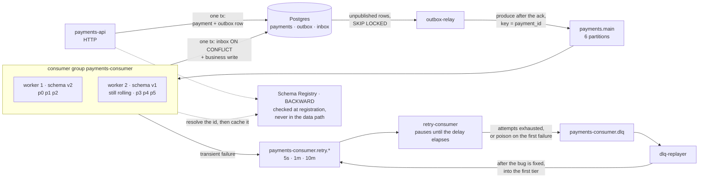

# Kafka-lab

A lab for **Apache Kafka in depth**: internals, delivery guarantees, and the operational
behaviour of a payments service built on them. Every claim in this repository is either
backed by a reproducible experiment (`make exp-NN`) with its numbers committed, or
marked `TBD` until that experiment has run.

**Status.** The diagrams and the internals documentation are in place, and so is the
cluster they describe: `make up` brings up three KRaft brokers, and the topics are
declared as YAML in [`deploy/topics/`](deploy/topics/) and applied with
[topicctl](https://github.com/segmentio/topicctl). The payments service described below is the
target of the service stage — **its code is not in this repository yet**, and the
architecture diagram is labelled accordingly rather than quietly implying otherwise.

| KR (PDP) | Deliverable | Where it lives | State |
|---|---|---|---|
| Fundamentals and internals | cheat sheet with write and read path diagrams | [`docs/static/`](docs/static/) — index plus cases 01–04 | diagrams done; exp-01…04 measured — a key is worth 7 964 – 8 721 ordering violations per 10 000 events; a skewed key makes seven consumers only 15% faster than one; compaction turned 2 010 records into 50; a killed broker is noticed within about ten seconds and never gives its leadership back, and raising `broker.session.timeout.ms` to 20 s moves that to 20.3 s while the lag timer everyone quotes stays put. Cases 01 and 03 still carry `TBD` rows for exp-08, 09, 16 and 17, case 02 lists three things exp-03 did not show, and case 04 lists exp-04b as blocked on this stand |
| Delivery guarantees and tuning | notes on semantics plus a tuning checklist | cases 05, 08, 10; [`docs/tuning-checklist.md`](docs/tuning-checklist.md) | mechanics and checklist written; every measured number waits on exp-05…10, 16, 17 |
| Production-shaped Go app | working repo, README, architecture diagram | `cmd/`, `internal/` (created at the service stage), this file | no Go code yet; the service is the next stage |
| Operate, observe, stress | Compose, Grafana dashboard, failure report, runbook | [`deploy/`](deploy/), `docs/failure-report.md`, `docs/runbook.md` | three-broker Compose runs; metrics stack and exp-13…16 outstanding |
| Patterns and anti-patterns | recommendations doc | `docs/patterns.md` | outstanding |
| Share findings | write-up or tech talk | `docs/talk.md`, and the walkthroughs in [`docs/dynamic/`](docs/dynamic/) | the talk is outstanding; the interactive cases are its backbone and already run |

## Running the cluster

```
make up                          # three KRaft brokers, waits until all are healthy
make topics                      # create or update the catalog in deploy/topics
make check                       # non-zero exit on drift or on a cluster unfit to measure on
make describe TOPICS=payments.main
make lag GROUP=payments-consumer
make reset-topic TOPIC=payments-consumer.dlq
make elect-preferred             # move leadership back to the preferred replicas
make stop                        # pause, keeping the brokers' data
make down                        # stop and wipe the brokers' data
```

Topics are declared, not scripted: one YAML file per topic, applied by
[topicctl](https://github.com/segmentio/topicctl). The permanent catalog lives in
[`deploy/topics/`](deploy/topics/). An experiment's own topics — `min.insync.replicas=3`
for exp-08, a compacted one for exp-03 — live in `experiments/<exp>/topics/` and are
applied with `make exp-topics EXP=<exp>`, so they neither become part of the catalog nor
keep being checked after the experiment is over.

Every YAML states `min.insync.replicas` explicitly, and `make check` refuses to run
otherwise. With eligible leader replicas (KIP-966, on by default in Kafka 4.x) the
controller keeps `min.insync.replicas` as a cluster-wide dynamic default — copied from the
broker setting, 2 here, when the cluster is first formatted — and topicctl would report
that inherited value as drift on every run of a YAML that leaves it out. Why every number
in the catalog is what it is, and which experiment gets a topic of its own, is written
down in [`deploy/topics/README.md`](deploy/topics/README.md).

`make check` is the step to run before every experiment. It fails on two kinds of problem.
**Drift**: a partition count or declared setting that no longer matches the YAML, and any
topic-level setting the YAML never declared. **Health**: replicas out of sync, throttles
left over from a reassignment, leaders off their preferred replica. The second kind matters
as much as the first — a measurement taken on a broker that leads four of six partitions
after the previous experiment is a number about that experiment, not about this one:

```
$ make check
  config settings correct | ✗ | 1 keys have different values between cluster and topic config: [cleanup.policy]
make: *** [check] Error 1
```

Because topicctl reads the replication factor off the in-sync replicas, a dead broker shows
up in `make check` as a failure too — which is the right answer before a measurement — and
`make topics` should only be run with all three brokers up.

Two behaviours of `topicctl apply` shape the rest. It **elects the preferred leader** on
every topic it touches, and with `auto.leader.rebalance.enable=false` that is the only thing
that moves leadership back on its own — so `make topics` is never run in the middle of an experiment
that measures leadership, and `make elect-preferred` exists to do it deliberately. And it
**only warns** about a setting the YAML never declared, leaving it in place, so
`make reset-topic` is the way back: it drops the topic and recreates it from its own YAML,
resetting the log as well as the config, without touching any other topic. It refuses to
delete a topic no YAML declares.

Brokers are reachable from the host at `localhost:19092,29092,39092`, bound to loopback
only. There is no restart policy on purpose: an experiment that kills a broker needs it
to stay dead until the experiment brings it back. Several broker defaults are pinned in
the Compose file for the same reason — auto leader rebalance and the retention check both
run on 300 s timers that would otherwise decide an experiment's outcome instead of Kafka.

## Target architecture



*Fig. — the bottom row is the write path and the top row is the consume path, and every
solid arrow between them is a boundary where atomicity ends: the API writes state and
event in one transaction and never calls the broker, the consumer writes the inbox row and
the business row in one transaction and never sleeps, and everything in between is
retryable delivery. The two dotted edges are the only ones that are not per record — the
registry is consulted when a schema is registered and once per unseen id, never in the
data path. The group is drawn mid-deploy, one worker on each schema version, because that
is the only state in which compatibility means anything
([09](docs/static/09-schema-evolution.md)).*

| Component | What it guarantees | Detail |
|---|---|---|
| `payments-api` | the payment and its event are written atomically, or neither is | [06](docs/static/06-transactional-outbox.md) |
| `outbox-relay` | an unavailable broker becomes a backlog, never a lost event or a failed request | [06](docs/static/06-transactional-outbox.md) |
| `payments.main` | ordering per `payment_id`, parallelism capped by partition count | [01](docs/static/01-write-path.md), [03](docs/static/03-read-path.md) |
| `payments-consumer` | a redelivered record changes nothing on the second pass | [05](docs/static/05-delivery-semantics.md) |
| `payments-consumer.retry.*` | a failing record waits without blocking the partition it came from; the chain belongs to the group, so a second group on `payments.main` gets its own | [07](docs/static/07-retry-dlq.md) |
| `payments-consumer.dlq` | a dead letter carries enough context to be replayed, not just logged, and is kept 30 days — long enough to fix, release and replay | [07](docs/static/07-retry-dlq.md) |
| Schema Registry | an incompatible schema is rejected at registration, not discovered at read. The registry is never in the data path: the producer encodes a schema id into the bytes, and each consumer resolves that id once and caches it | [09](docs/static/09-schema-evolution.md) |

Two things this diagram deliberately does **not** contain: a `kafka.Publish()` call
inside the use case, and a `time.Sleep` inside the main consumer. Both are the obvious
implementation, and both are why the two patterns above exist.

## Documentation

**[`docs/static/`](docs/static/)** — the deliverable, and the cheat sheet: it opens with
a one-screen summary of the internals, then one case per file, rendered by GitHub without
running anything. Where a case is a comparison — where the message is lost, which
assignor, which deploy order — the file draws every side of it, because the argument is
the difference between two pictures.

| # | Case | The question it answers | Interactive |
|---|---|---|---|
| [01](docs/static/01-write-path.md) | Write path | What must happen before `Produce` returns success? | [yes](docs/dynamic/write-path/) |
| [02](docs/static/02-log-segments-retention.md) | The log on disk | What is stored, and which "current offset" is meant? | — |
| [03](docs/static/03-read-path.md) | Read path | How does a consumer get a partition and a starting offset? | [yes](docs/dynamic/read-path/) |
| [04](docs/static/04-isr-leader-election.md) | ISR and leader election | What makes an acknowledged record disappear? | — |
| [05](docs/static/05-delivery-semantics.md) | Delivery semantics | Where exactly is a message lost or duplicated? | [yes](docs/dynamic/lost-message/) |
| [06](docs/static/06-transactional-outbox.md) | Transactional outbox | Where does atomicity end between Postgres and Kafka? | [yes](docs/dynamic/outbox/) |
| [07](docs/static/07-retry-dlq.md) | Retry chain and DLQ | Where does a failing message wait, and who is blocked? | [yes](docs/dynamic/retry-dlq/) |
| [08](docs/static/08-rebalance.md) | Eager vs cooperative rebalance | How long does the group stop processing? | [yes](docs/dynamic/rebalance/) |
| [09](docs/static/09-schema-evolution.md) | Schema evolution | Who gets upgraded first, producers or consumers? | — |
| [10](docs/static/10-transactions-eos.md) | Transactions and EOS | What does a Kafka transaction cover, and where does it stop? | — |

**[`docs/00-journal.md`](docs/00-journal.md)** — the lab journal: one entry per run, with
what was expected, what the cluster did and what was surprising. The case files quote its
numbers; it is where they come from. Each run lives in
[`experiments/`](experiments/) and is reproducible with `make exp-NN`.

**[`docs/tuning-checklist.md`](docs/tuning-checklist.md)** — every setting that matters,
what it buys, what it costs, and the defaults where franz-go and the Java client disagree.

**[`docs/dynamic/`](docs/dynamic/)** — six of those ten cases as interactive
walkthroughs: open `docs/dynamic/index.html` in a browser and step through with the arrow
keys. Built for learning the mechanics and for presenting them; not a replacement for the
static files.

## The three rules this repository follows

**Evidence, not assertion.** A statement about Kafka behaviour is worth exactly as much
as the run that demonstrates it. Every document ends with the experiments that back it
and the ones still outstanding.

**A caption states a conclusion.** Not "Fig. 3. The consumer", but "Fig. 3. The broker
delivers nothing and assigns nothing". A diagram that needs two sentences is drawing two
things.

**Failure windows are drawn, not described.** Half of these cases exist because
something goes wrong, so the window in which it goes wrong is on the diagram.

## Stack

| Choice | Why |
|---|---|
| franz-go | pure Go, no cgo, transactions supported |
| Kafka 4.x in KRaft mode, 3 brokers | no ZooKeeper, and a real ISR to break |
| Postgres | outbox and inbox need a transaction, not a cache |
| payments as the domain | money makes every Kafka failure mode concrete |
