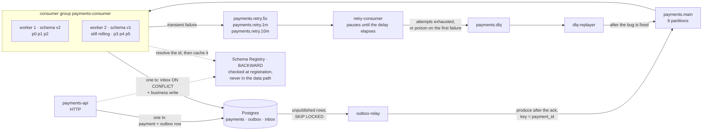

# Kafka-lab

A lab for **Apache Kafka in depth**: internals, delivery guarantees, and the operational
behaviour of a payments service built on them. Every claim in this repository is either
backed by a reproducible experiment (`make exp-NN`) with its numbers committed, or
marked `TBD` until that experiment has run.

**Status.** The diagrams and the internals documentation are in place, and so is the
cluster they describe: `make up` brings up three KRaft brokers and `labctl` creates the
topics and prints their leaders and ISR. The payments service described below is the
target of the service stage — **its code is not in this repository yet**, and the
architecture diagram is labelled accordingly rather than quietly implying otherwise.

| KR (PDP) | Deliverable | Where it lives | State |
|---|---|---|---|
| Fundamentals and internals | cheat sheet with write and read path diagrams | [`docs/static/`](docs/static/) — index plus cases 01–04 | diagrams done; every number is `TBD` until exp-01…04 have run |
| Delivery guarantees and tuning | notes on semantics plus a tuning checklist | cases 05, 08, 10; `docs/tuning-checklist.md` | mechanics drawn; checklist and exp-05…10, 16, 17 outstanding |
| Production-shaped Go app | working repo, README, architecture diagram | `cmd/`, `internal/`, this file | `labctl` only; the service is the next stage |
| Operate, observe, stress | Compose, Grafana dashboard, failure report, runbook | [`deploy/`](deploy/), `docs/failure-report.md`, `docs/runbook.md` | three-broker Compose runs; metrics stack and exp-13…16 outstanding |
| Patterns and anti-patterns | recommendations doc | `docs/patterns.md` | outstanding |
| Share findings | write-up or tech talk | `docs/talk.md`, and the walkthroughs in [`docs/dynamic/`](docs/dynamic/) | the talk is outstanding; the interactive cases are its backbone and already run |

## Running the cluster

```
make up            # three KRaft brokers, waits until all are healthy
make topics        # creates the payments topics, or reports how a live one drifted
make describe      # leader, replicas, ISR and under-replication per partition
make down          # stops everything and wipes the brokers' state
make verify        # build, vet, golangci-lint, go test -race
```

One experiment topic at a time, for the cases the catalog deliberately does not cover:

```
go run ./cmd/labctl create-topic -name exp08.isr3 -partitions 3 -rf 3 -config min.insync.replicas=3
go run ./cmd/labctl add-partitions -add 2 exp02.hot      # the exp-02 remedy, and its cost
go run ./cmd/labctl delete-topic exp08.isr3              # put the cluster back
go run ./cmd/labctl lag payments-consumer                # committed, end, lag per partition
go run ./cmd/labctl -v describe exp08.isr3               # -v logs what the client asks the brokers
```

`make topics` is a check, not just a setup step. A topic that already exists is compared
against the catalog in both directions: a partition count, replication factor or declared
setting that no longer matches is drift, **and so is any topic-level override the catalog
never declared**. An experiment that reshapes a topic — turning it compacted, say —
therefore cannot be inherited silently by the next one, which would otherwise produce a
number that looks real and is not:

```
$ go run ./cmd/labctl topics
TOPIC          STATE    DRIFT
payments.dlq   drifted  cleanup.policy: want unset, got compact
exit status 1
```

`delete-topic` is the way back: drop the reshaped topic and let `make topics` recreate it,
instead of wiping the whole cluster and every other experiment's state with it.

Brokers are reachable from the host at `localhost:19092,29092,39092`, bound to loopback
only. There is no restart policy on purpose: an experiment that kills a broker needs it
to stay dead until the experiment brings it back. Several broker defaults are pinned in
the Compose file for the same reason — auto leader rebalance and the retention check both
run on 300 s timers that would otherwise decide an experiment's outcome instead of Kafka.

## Target architecture



*Fig. — the bottom row is the write path and the top row is the consume path, and every
solid arrow between them is a boundary where atomicity ends: the API writes state and
event in one transaction and never calls the broker, the consumer writes the inbox row and
the business row in one transaction and never sleeps, and everything in between is
retryable delivery. The two dotted edges are the only ones that are not per record — the
registry is consulted when a schema is registered and once per unseen id, never in the
data path. The group is drawn mid-deploy, one worker on each schema version, because that
is the only state in which compatibility means anything
([09](docs/static/09-schema-evolution.md)).*

| Component | What it guarantees | Detail |
|---|---|---|
| `payments-api` | the payment and its event are written atomically, or neither is | [06](docs/static/06-transactional-outbox.md) |
| `outbox-relay` | an unavailable broker becomes a backlog, never a lost event or a failed request | [06](docs/static/06-transactional-outbox.md) |
| `payments.main` | ordering per `payment_id`, parallelism capped by partition count | [01](docs/static/01-write-path.md), [03](docs/static/03-read-path.md) |
| `payments-consumer` | a redelivered record changes nothing on the second pass | [05](docs/static/05-delivery-semantics.md) |
| retry topics | a failing record waits without blocking the partition it came from | [07](docs/static/07-retry-dlq.md) |
| `payments.dlq` | a dead letter carries enough context to be replayed, not just logged | [07](docs/static/07-retry-dlq.md) |
| Schema Registry | an incompatible schema is rejected at registration, not discovered at read. The registry is never in the data path: the producer encodes a schema id into the bytes, and each consumer resolves that id once and caches it | [09](docs/static/09-schema-evolution.md) |

Two things this diagram deliberately does **not** contain: a `kafka.Publish()` call
inside the use case, and a `time.Sleep` inside the main consumer. Both are the obvious
implementation, and both are why the two patterns above exist.

## Documentation

**[`docs/static/`](docs/static/)** — the deliverable, and the cheat sheet: it opens with
a one-screen summary of the internals, then one case per file, rendered by GitHub without
running anything. Where a case is a comparison — where the message is lost, which
assignor, which deploy order — the file draws every side of it, because the argument is
the difference between two pictures.

| # | Case | The question it answers | Interactive |
|---|---|---|---|
| [01](docs/static/01-write-path.md) | Write path | What must happen before `Produce` returns success? | [yes](docs/dynamic/write-path/) |
| [02](docs/static/02-log-segments-retention.md) | The log on disk | What is stored, and which "current offset" is meant? | — |
| [03](docs/static/03-read-path.md) | Read path | How does a consumer get a partition and a starting offset? | [yes](docs/dynamic/read-path/) |
| [04](docs/static/04-isr-leader-election.md) | ISR and leader election | What makes an acknowledged record disappear? | — |
| [05](docs/static/05-delivery-semantics.md) | Delivery semantics | Where exactly is a message lost or duplicated? | [yes](docs/dynamic/lost-message/) |
| [06](docs/static/06-transactional-outbox.md) | Transactional outbox | Where does atomicity end between Postgres and Kafka? | [yes](docs/dynamic/outbox/) |
| [07](docs/static/07-retry-dlq.md) | Retry chain and DLQ | Where does a failing message wait, and who is blocked? | [yes](docs/dynamic/retry-dlq/) |
| [08](docs/static/08-rebalance.md) | Eager vs cooperative rebalance | How long does the group stop processing? | [yes](docs/dynamic/rebalance/) |
| [09](docs/static/09-schema-evolution.md) | Schema evolution | Who gets upgraded first, producers or consumers? | — |
| [10](docs/static/10-transactions-eos.md) | Transactions and EOS | What does a Kafka transaction cover, and where does it stop? | — |

**[`docs/dynamic/`](docs/dynamic/)** — six of those ten cases as interactive
walkthroughs: open `docs/dynamic/index.html` in a browser and step through with the arrow
keys. Built for learning the mechanics and for presenting them; not a replacement for the
static files.

## The three rules this repository follows

**Evidence, not assertion.** A statement about Kafka behaviour is worth exactly as much
as the run that demonstrates it. Every document ends with the experiments that back it
and the ones still outstanding.

**A caption states a conclusion.** Not "Fig. 3. The consumer", but "Fig. 3. The broker
delivers nothing and assigns nothing". A diagram that needs two sentences is drawing two
things.

**Failure windows are drawn, not described.** Half of these cases exist because
something goes wrong, so the window in which it goes wrong is on the diagram.

## Stack

| Choice | Why |
|---|---|
| franz-go | pure Go, no cgo, transactions supported |
| Kafka 4.x in KRaft mode, 3 brokers | no ZooKeeper, and a real ISR to break |
| Postgres | outbox and inbox need a transaction, not a cache |
| payments as the domain | money makes every Kafka failure mode concrete |
