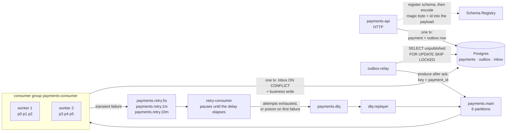

# Kafka-lab

A lab for **Apache Kafka in depth**: internals, delivery guarantees, and the operational
behaviour of a payments service built on them. Every claim in this repository is either
backed by a reproducible experiment (`make exp-NN`) with its numbers committed, or
marked `TBD` until that experiment has run.

**Status.** The diagrams and the internals documentation are in place. The Go service
described below is the target of the service stage — **the code is not in this
repository yet**, and the architecture diagram is labelled accordingly rather than
quietly implying otherwise.

## Target architecture

*Fig. — every boundary in this diagram is a place where atomicity ends: the API writes
state and event in one transaction and never calls the broker, the consumer writes the
inbox row and the business row in one transaction and never sleeps, and everything
between them is retryable delivery.*

| Component | What it guarantees | Detail |
|---|---|---|
| `payments-api` | the payment and its event are written atomically, or neither is | [06](docs/static/06-transactional-outbox.md) |
| `outbox-relay` | an unavailable broker becomes a backlog, never a lost event or a failed request | [06](docs/static/06-transactional-outbox.md) |
| `payments.main` | ordering per `payment_id`, parallelism capped by partition count | [01](docs/static/01-write-path.md), [03](docs/static/03-read-path.md) |
| `payments-consumer` | a redelivered record changes nothing on the second pass | [05](docs/static/05-delivery-semantics.md) |
| retry topics | a failing record waits without blocking the partition it came from | [07](docs/static/07-retry-dlq.md) |
| `payments.dlq` | a dead letter carries enough context to be replayed, not just logged | [07](docs/static/07-retry-dlq.md) |
| Schema Registry | an incompatible schema is rejected at registration, not discovered at read. The registry is never in the data path: the producer encodes a schema id into the bytes, and each consumer resolves that id once and caches it | [09](docs/static/09-schema-evolution.md) |

Two things this diagram deliberately does **not** contain: a `kafka.Publish()` call
inside the use case, and a `time.Sleep` inside the main consumer. Both are the obvious
implementation, and both are why the two patterns above exist.

## Documentation

**[`docs/static/`](docs/static/)** — the deliverable, and the cheat sheet: it opens with
a one-screen summary of the internals, then one case per file, one diagram per case,
rendered by GitHub without running anything.

| # | Case | The question it answers | Interactive |
|---|---|---|---|
| [01](docs/static/01-write-path.md) | Write path | What must happen before `Produce` returns success? | [yes](docs/dynamic/write-path/) |
| [02](docs/static/02-log-segments-retention.md) | The log on disk | What is stored, and which "current offset" is meant? | — |
| [03](docs/static/03-read-path.md) | Read path | How does a consumer get a partition and a starting offset? | [yes](docs/dynamic/read-path/) |
| [04](docs/static/04-isr-leader-election.md) | ISR and leader election | What makes an acknowledged record disappear? | — |
| [05](docs/static/05-delivery-semantics.md) | Delivery semantics | Where exactly is a message lost or duplicated? | [yes](docs/dynamic/lost-message/) |
| [06](docs/static/06-transactional-outbox.md) | Transactional outbox | Where does atomicity end between Postgres and Kafka? | [yes](docs/dynamic/outbox/) |
| [07](docs/static/07-retry-dlq.md) | Retry chain and DLQ | Where does a failing message wait, and who is blocked? | [yes](docs/dynamic/retry-dlq/) |
| [08](docs/static/08-rebalance.md) | Eager vs cooperative rebalance | How long does the group stop processing? | [yes](docs/dynamic/rebalance/) |
| [09](docs/static/09-schema-evolution.md) | Schema evolution | Who gets upgraded first, producers or consumers? | — |
| [10](docs/static/10-transactions-eos.md) | Transactions and EOS | What does a Kafka transaction cover, and where does it stop? | — |

**[`docs/dynamic/`](docs/dynamic/)** — six of those ten cases as interactive
walkthroughs: open `docs/dynamic/index.html` in a browser and step through with the arrow
keys. Built for learning the mechanics and for presenting them; not a replacement for the
static files.

## The three rules this repository follows

**Evidence, not assertion.** A statement about Kafka behaviour is worth exactly as much
as the run that demonstrates it. Every document ends with the experiments that back it
and the ones still outstanding.

**A caption states a conclusion.** Not "Fig. 3. The consumer", but "Fig. 3. The broker
delivers nothing and assigns nothing". A diagram that needs two sentences is drawing two
things.

**Failure windows are drawn, not described.** Half of these cases exist because
something goes wrong, so the window in which it goes wrong is on the diagram.

## Stack

| Choice | Why |
|---|---|
| franz-go | pure Go, no cgo, transactions supported |
| Kafka 4.x in KRaft mode, 3 brokers | no ZooKeeper, and a real ISR to break |
| Postgres | outbox and inbox need a transaction, not a cache |
| payments as the domain | money makes every Kafka failure mode concrete |
