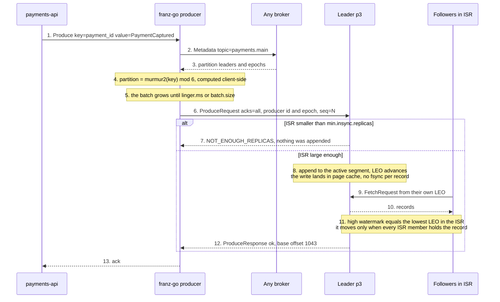

# 01 — Write path

**The question:** what has to happen before `Produce` returns success, and what has
*not* happened yet at that moment?

KR1 · interactive version: [`docs/dynamic/write-path/`](../dynamic/write-path/)

*Fig. 1 — with `acks=all` the acknowledgement arrives after replication to every in-sync
replica and before any `fsync`: durability here is a property of replication, not of the
disk (exp-08).*

## What each step really is

The numbers are written into the diagram by hand, and they cover the pauses as well as
the arrows — steps 4, 5, 8 and 11 are where the interesting things happen, and Mermaid's
`autonumber` would have skipped every one of them.

| # | What actually happens | Config that moves it | What breaks if you get it wrong |
|---|---|---|---|
| 1 | An in-memory call. Nothing has touched the network. | — | Treating the return of `Produce` as durability. In franz-go the promise callback, not the call, is the event that matters. |
| 2–3 | The client asks **any** broker where the partition leaders are, and caches the answer. Placement is never decided by a broker. | `metadata.max.age.ms` | After leadership moves, the broker answers `NOT_LEADER_OR_FOLLOWER`. A client that does not refresh metadata retries into a void. |
| 4 | `murmur2(key) mod partitions`, computed client-side. franz-go hashes keys the way the Java client does, so a Go producer and a Java producer put the same key on the same partition. | `partitioner` | `key=nil` means no ordering for that entity. franz-go then sticks to one partition until the batch closes, so at low volume nothing looks broken and you conclude keys are optional — exp-01 has to push enough traffic to break it. |
| 5 | The batch, not the record, is the unit of transfer. Compression happens here, in the producer. | `linger.ms`, `batch.size`, `compression` | This is the throughput-versus-latency dial. "Kafka is slow" almost always means `linger.ms` was never touched. |
| 6 | The request carries a producer id, an epoch and a per-partition sequence number, and the broker rejects a sequence it has already accepted. | `enable.idempotence` | Retries are deduplicated **within one producer session**. Across a restart the id changes and the guarantee ends — which is why the service still needs an outbox and an inbox. |
| 7 | The ISR size is checked **before** the append. Too few in-sync replicas and the record is rejected outright, with nothing written. | `min.insync.replicas`, `acks` | With `min.insync.replicas=1` the cluster degrades silently: `acks=all` keeps returning success while one surviving replica holds the data. |
| 8 | The append goes into the page cache. Kafka does not `fsync` per record. | `flush.messages`, `flush.ms` — leave them alone | Believing "acked" means "on disk on three machines". It means "in the page cache of three machines". |
| 9–10 | Replication is a **fetch**. Followers pull on their own schedule, the leader never pushes. | `replica.lag.time.max.ms` | Expecting the leader to notice a dead follower instantly. It notices after 30 seconds by default — see [04](04-isr-leader-election.md). |
| 11 | The high watermark is the lowest LEO across the ISR. Consumers never see above it. | — | This is precisely why a consumer cannot read a record that a leader failure could still erase. |
| 12 | The response is released only once the record is replicated across the whole ISR — the same condition that moves the high watermark. | `acks` | With `acks=1` the leader answers after its own append. Kill it before the followers fetch and the acknowledged record is gone (exp-08). |
| 13 | Only now does the payment exist for the rest of the system. | `delivery.timeout.ms` | A timeout here is an **unknown outcome**, not a failure. The write may well have been accepted. Recording it as failed and moving on is how money is lost. |

## Three claims this diagram exists to kill

**"`acks=all` means all replicas."** It means all replicas *currently in the ISR*. A
partition with `replication.factor=3` whose ISR has shrunk to one still returns success
for `acks=all` — it is just returning success from a single machine.
`min.insync.replicas=2` converts that silent degradation into a visible
`NOT_ENOUGH_REPLICAS` rejection. Failing loudly is the entire point.

**"Acknowledged means written to disk."** There is no `fsync` on this path. The record
is in the leader's page cache and in the page cache of every in-sync follower. That is
stronger than one disk and weaker than three disks, and the difference shows up exactly
once: a power event that takes the rack down together.

**"It retried, so there may be duplicates."** With `enable.idempotence=true` every batch
carries a producer id, an epoch and a per-partition sequence number, and the broker
rejects a sequence it has already accepted. Retries within one producer session are
deduplicated by the broker. Across a producer **restart** the id changes and the
guarantee ends — that boundary is why the service still needs an outbox and an inbox
([05](05-delivery-semantics.md), [06](06-transactional-outbox.md)).

## To be measured

| Run | What it shows | Status |
|---|---|---|
| exp-01 | `key=nil` vs `key=payment_id`: ordering violations per 10 000 events | TBD |
| exp-08 | `acks=1` plus leader kill vs `acks=all` with `min.insync.replicas=2` | TBD |
| exp-09 | idempotence off, five in-flight requests, injected network failure: reordering | TBD |
