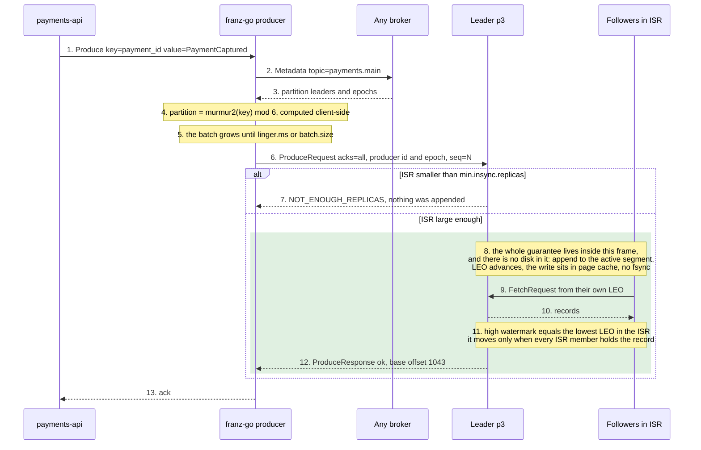

# 01 — Write path

**The question:** what has to happen before `Produce` returns success, and what has
*not* happened yet at that moment?

KR1 · interactive version: [`docs/dynamic/write-path/`](../dynamic/write-path/)

*Fig. 1 — the frame is the entire meaning of `acks=all`: the record is in the page cache
of every replica **currently in the ISR**, no `fsync` has happened on any of them, and
how much that is worth depends on how wide the ISR was at step 8, not on how the topic
was configured (exp-08).*

## What each step really is

The numbers are written into the diagram by hand, and they cover the pauses as well as
the arrows — steps 4, 5, 8 and 11 are where the interesting things happen, and Mermaid's
`autonumber` would have skipped every one of them. The frame around 8–12 is the answer to
the second half of the question: it contains everything the acknowledgement promises, and
a `fsync` is not in it.

| # | What actually happens | Config that moves it | What breaks if you get it wrong |
|---|---|---|---|
| 1 | An in-memory call. Nothing has touched the network. | — | Treating the return of `Produce` as durability. In franz-go the promise callback, not the call, is the event that matters. |
| 2–3 | The client asks **any** broker where the partition leaders are, and caches the answer. Placement is never decided by a broker. | `metadata.max.age.ms` | After leadership moves, the broker answers `NOT_LEADER_OR_FOLLOWER`. A client that does not refresh metadata retries into a void. |
| 4 | `murmur2(key) mod partitions`, computed client-side. With no key franz-go's `UniformBytesPartitioner` stays on one partition until 64 KiB have gone to it, then moves — so a small run looks ordered and a real one is not: between 7 964 and 8 721 of 10 000 events arrived out of order across three runs (exp-01). franz-go hashes keys the way the Java client does, so a Go producer and a Java producer put the same key on the same partition. | `partitioner` → `kgo.RecordPartitioner` | `key=nil` means no ordering for that entity. franz-go's default is `UniformBytesPartitioner(64 KiB, adaptive, keys)` — the KIP-794 uniform sticky partitioner, not the older sticky-until-the-batch-closes one — so a keyless stream stays on one partition until **64 KiB** have gone to it and only then re-picks. At low volume nothing looks broken and you conclude keys are optional; exp-01 has to push well past that threshold to break it. |
| 5 | The batch, not the record, is the unit of transfer. Compression happens here, in the producer. | `linger.ms` → `kgo.ProducerLinger` (**10 ms**, Java: 5 ms since Kafka 4.0, 0 before) · `batch.size` → `kgo.ProducerBatchMaxBytes` (**≈1 MB**, Java: 16 KB) · `compression.type` → `kgo.ProducerBatchCompression` (**snappy**, Java: none) | This is the throughput-versus-latency dial, and the three defaults above all differ from Java's — a franz-go producer already lingers and already compresses, so "the Go service is slower/cheaper than the Java one" starts here rather than in the code (exp-17). |
| 6 | The request carries a producer id, an epoch and a per-partition sequence number, and the broker rejects a sequence it has already accepted. | `enable.idempotence` | Retries are deduplicated **within one producer session**. Across a restart the id changes and the guarantee ends — which is why the service still needs an outbox and an inbox. |
| 7 | The ISR size is checked **before** the append. Too few in-sync replicas and the record is rejected outright, with nothing written. | `min.insync.replicas`, `acks` | With `min.insync.replicas=1` the cluster degrades silently: `acks=all` keeps returning success while one surviving replica holds the data. |
| 8 | The append goes into the page cache. Kafka does not `fsync` per record. | `flush.messages`, `flush.ms` — leave them alone | Believing "acked" means "on disk on three machines". It means "in the page cache of three machines". |
| 9–10 | Replication is a **fetch**. Followers pull on their own schedule, the leader never pushes. | `replica.lag.time.max.ms`, `broker.session.timeout.ms` | Expecting the ISR to react instantly, and expecting one timer to cover both cases. A follower that merely slows down leaves the ISR after `replica.lag.time.max.ms`, 30 s by default; a broker that *dies* is removed when the controller fences its session, 9 s by default — exp-04 measured 10.1 s and 10.6 s for the crash case, and exp-04c moved the reaction to 20.3 s by raising only that timer — see [04](04-isr-leader-election.md). |
| 11 | The high watermark is the lowest LEO across the ISR. Consumers never see above it. | — | This is precisely why a consumer cannot read a record that a leader failure could still erase. |
| 12 | The response is released only once the record is replicated across the whole ISR — the same condition that moves the high watermark. | `acks` | With `acks=1` the leader answers after its own append, and whether a kill loses the record is a race against the follower fetch. exp-08 held that window open by pausing both followers: the leader acknowledged 2 000 records, was killed, a follower was elected, and 0 were readable — all 2 000 lost with no error anywhere. Unpaused, the window lasts as long as replication lag, which is why it fires rarely and reports nothing. |
| 13 | Only now does the payment exist for the rest of the system. | `delivery.timeout.ms` | A timeout here is an **unknown outcome**, not a failure. The write may well have been accepted. Recording it as failed and moving on is how money is lost. |

## Three claims this diagram exists to kill

**"`acks=all` means all replicas."** It means all replicas *currently in the ISR*. A
partition with `replication.factor=3` whose ISR has shrunk to one still returns success
for `acks=all` — it is just returning success from a single machine.
`min.insync.replicas=2` converts that silent degradation into a visible
`NOT_ENOUGH_REPLICAS` rejection. Failing loudly is the entire point.

**"Acknowledged means written to disk."** There is no `fsync` on this path. The record
is in the leader's page cache and in the page cache of every in-sync follower. That is
stronger than one disk and weaker than three disks, and the difference shows up exactly
once: a power event that takes the rack down together.

**"It retried, so there may be duplicates."** With `enable.idempotence=true` every batch
carries a producer id, an epoch and a per-partition sequence number, and the broker
rejects a sequence it has already accepted. Retries within one producer session are
deduplicated by the broker. Across a producer **restart** the id changes and the
guarantee ends — that boundary is why the service still needs an outbox and an inbox
([05](05-delivery-semantics.md), [06](06-transactional-outbox.md)).

## To be measured

| Run | What it shows | Status |
|---|---|---|
| exp-01 | `key=nil` vs `key=payment_id`: ordering violations per 10 000 events | **keyless: 7 964 – 8 721 violations over three runs, all 100 payments split across partitions every time. Keyed: 0 violations, 0 split.** [runs](../../experiments/kafka_internals/exp-01-partition-keys/results/) |
| exp-08 | `acks=1` plus leader kill vs `acks=all` with `min.insync.replicas=3` when one broker dies | **`acks=all` with `min.insync.replicas=3`: 2 000 of 2 000 accepted with every broker up, 0 of 2 000 with one down — `NOT_ENOUGH_REPLICAS`, refused rather than lost** [run](../../experiments/transaction_guarantee/exp-08-acks/results/acks-all-2026-09-21-183122.log). **`acks=1` with both followers paused: 2 000 acknowledged, leader killed, a follower elected, 0 readable — 2 000 of 2 000 lost** [run](../../experiments/transaction_guarantee/exp-08-acks/results/acks-one-2026-09-22-000605.log) |
| exp-09 | idempotence off, five in-flight requests, a follower frozen three times under `min.insync.replicas=3` | **Idempotence off: 217 840 produced, 218 131 read back — 291 duplicates, zero out of order** [run](../../experiments/transaction_guarantee/exp-09-reordering/results/plain-2026-09-21-184103.log). **Idempotent: 266 980 and 266 980, zero of either** [run](../../experiments/transaction_guarantee/exp-09-reordering/results/idempotent-2026-09-21-184103.log). The third run counted its retries: the plain producer's 80 duplicates are exactly the 80 records appended and then answered `REQUEST_TIMED_OUT` — a duplicate any client without idempotence makes — and none came from franz-go's rewind; the idempotent one retried 100 such records and the broker dropped them all [run 3](../../experiments/transaction_guarantee/exp-09-reordering/results/plain-2026-09-22-000803.log). Duplicates across three runs: 291, 80, 80; reordered: 0 every time |
| exp-17 | `linger` × batch size × codec sweep: throughput against p99 produce latency, and what the franz-go defaults already cost | **At 20 000 records/s no cell fell behind; what differed is latency and bytes. Linger decides batching (≈5, 22, 34, 140 records per batch at 0, 5, 10, 50 ms) and batching decides compression (zstd 3.0× → 5.6×). franz-go's 10 ms against franz-go set to Java's 5 ms: +1.5–2 ms median for batches half as large again** (no Java client was run) [run 1](../../experiments/transaction_guarantee/exp-17-batching-sweep/results/run-2026-09-21-191906.log) · [run 2](../../experiments/transaction_guarantee/exp-17-batching-sweep/results/run-2026-09-21-192434.log) |
