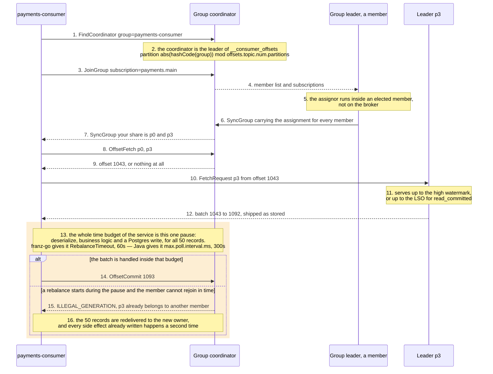

# 03 — Read path

**The question:** how does a consumer end up owning a partition and a starting offset,
and who decides each of those?

KR1 · interactive version: [`docs/dynamic/read-path/`](../dynamic/read-path/)

*Fig. 3 — the broker delivers nothing and assigns nothing: the consumer pulls, one of the
consumers computes the assignment, and all the coordinator owns is membership and
committed offsets. The amber pause is where the service actually spends its time, and it
is the only step here that can lose the partition mid-batch (exp-02, exp-16).*

## What each step really is

| # | What actually happens | What breaks if you get it wrong |
|---|---|---|
| 1–2 | The coordinator is one specific broker: the group id is hashed onto the partitions of `__consumer_offsets` — 50 by default, 3 on this stand, where the compose file sets `offsets.topic.num.partitions` — and the leader of that partition takes the job. The hash is Java's `String.hashCode`, **not** the `murmur2` that partitions records by key — two different hashes, two different purposes. | Killing "some broker" during a failure drill may kill the coordinator and produce a much larger outage than the one being tested (exp-13). |
| 3–6 | **Classic protocol.** Members join, the coordinator elects one of them leader and hands it the member list, that member computes the assignment, the coordinator distributes each share. The assignment algorithm runs in a client. | Believing the broker balances the group. It does not: a bad custom assignor is a client-side bug, and every member must agree on the same assignor or the group cannot form. |
| 7 | One partition belongs to exactly one member of a group. That is the whole parallelism model — there is nothing finer-grained than a partition. | More consumers than partitions means the extras idle forever. Six partitions is a hard ceiling of six workers (exp-02). |
| 8–9 | Committed offsets live in `__consumer_offsets`, compacted, keyed by group, topic and partition — never in the consumer process. | With no committed offset `auto.offset.reset` decides: `earliest` replays all history, `latest` silently skips everything produced before the consumer appeared. A misconfigured `latest` looks exactly like "the messages never arrived" — and the clients disagree on the default: Java starts a new group at `latest`, franz-go starts it at the beginning (`ConsumeStartOffset` = `AtStart`). The reset of an *expired committed* offset is a separate option again, `ConsumeResetOffset`, whose default (`RewindOffset(1m)`) has no Java equivalent at all. |
| 10 | The consumer asks a partition leader for records and waits for `fetch.min.bytes` or `fetch.max.wait.ms`. Nothing is ever pushed. | Tuning "consumer throughput" without touching fetch sizing. With `client.rack` plus a rack-aware replica selector on the broker, fetches can be served by a follower (KIP-392) — relevant to cross-AZ cost, not to this lab. |
| 11 | For `read_uncommitted` the ceiling is the high watermark. For `read_committed` it is the **LSO**, and aborted-transaction records are filtered out using the aborted-transaction index. | A `read_committed` consumer stalling while `read_uncommitted` consumers are fine is one open transaction pinning the LSO — see [02](02-log-segments-retention.md). |
| 12 | The broker ships the stored batch straight from the page cache: it does not decompress, deserialize or inspect records. Compression is end-to-end between producer and consumer. | True on the fast path only. TLS disables `sendfile` zero-copy because the bytes must be encrypted in user space; the broker recompresses if the topic's `compression.type` differs from the producer's; down-converting for an old client message format costs CPU and heap. A broker at 100% CPU "with no traffic" is usually one of these three. |
| 13 | Deserialization, business logic and database writes — the entire time budget lives in this one pause. | Take too long and the group moves on without you. Heartbeats keep flowing from a background thread, so the session timeout is not what fires: it is the rebalance timeout. In the Java client the trigger is `max.poll.interval.ms`, which doubles as the rebalance timeout. **franz-go has no poll watchdog at all** — it exposes `kgo.RebalanceTimeout`, `kgo.SessionTimeout` and `kgo.BlockRebalanceOnPoll` instead, so a slow handler goes unnoticed until a rebalance actually happens, and then finishes inside a 60 s default rather than Java's 300 s (exp-16). |
| 14 | A commit is just another produce, into `__consumer_offsets`. | Commit before processing and a crash loses records; commit after and a crash duplicates them. There is no third option — see [05](05-delivery-semantics.md). |
| 15–16 | The other exit from the pause, and the reason the frame is drawn at all. The member is not fenced for being slow as such: it is fenced because a rebalance started while it was busy and it did not rejoin within the rebalance timeout. Its commit then fails with `ILLEGAL_GENERATION`, and the batch is handed to whoever owns the partition now. | Reading this as "a rebalance costs some latency". It costs a **reprocessed batch**: every row already written by the doomed member is written again by the new owner. A slow handler is therefore a duplicate generator, not only a lag generator — which is the whole argument for the inbox in [05](05-delivery-semantics.md). |

## The batch is the unit, not the record

A fetch returns whole batches as they lie on disk. `max.poll.records` slices what the
Java client hands to application code, but the bytes already crossed the network — and
franz-go has no such knob at all. Sizing a fetch for throughput can therefore deliver far
more data at once than a handler expects, and that is where "the consumer suddenly took
40 seconds on one poll" comes from.

## Protocol version warning

This file describes the **classic** group protocol: `JoinGroup`, `SyncGroup`,
generations, assignment computed by a member. KIP-848 is GA in Kafka 4.0 and replaces it
with incremental, broker-side assignment carried over `ConsumerGroupHeartbeat`, removing
the round trip drawn above. Before quoting either version, confirm which protocol the
pinned franz-go build negotiates against the pinned broker image — the answer belongs in
the write-up, not in an assumption.

## To be measured

| Run | What it shows | Status |
|---|---|---|
| exp-02 | consumers added beyond partition count: lag per partition does not improve | TBD |
| exp-16 | slow handler, lag spike, and what the client actually does about it — in three phases: lag on one partition, eviction from the group, and a deliberate pause ([07](07-retry-dlq.md)) | TBD |
