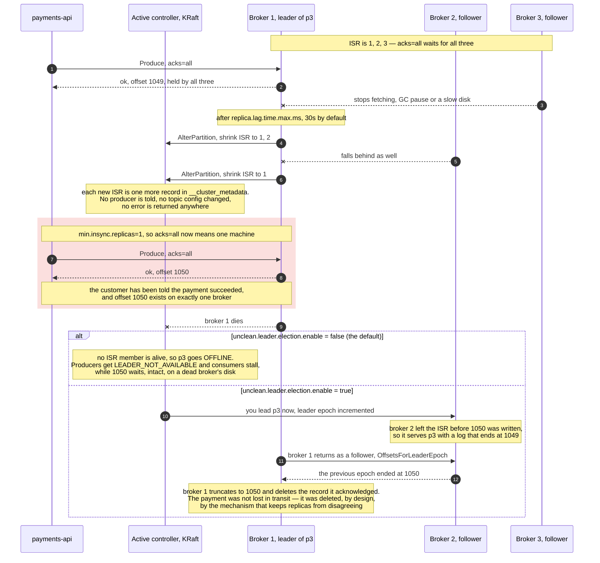

# 04 — ISR, leader election, and what "acknowledged" survives

**The question:** what sequence of events makes a record that Kafka already
acknowledged disappear?

KR1 · no interactive twin yet — this case is the one that justifies every default in
[01](01-write-path.md).

*Fig. 4 — the ISR shrinks in silence and `min.insync.replicas=1` lets `acks=all` keep
returning success from a single machine; what happens to the acknowledged offset 1050 is
then decided by one flag, and neither branch is pleasant: `false` takes the partition
offline, `true` deletes the payment with a routine truncation (exp-04, exp-04b).*

## Who decides what

| Decision | Who makes it | Where it is recorded |
|---|---|---|
| a follower is too slow, shrink the ISR | the partition **leader**, via `AlterPartition` | `__cluster_metadata` |
| a broker is gone, elect a new leader | the **active controller** | `__cluster_metadata` |
| which replica may become leader | the ISR, plus `unclean.leader.election.enable` | topic and broker config |
| where a returning replica truncates | the returning replica, using `leader-epoch-checkpoint` | the partition directory |

In KRaft there is no ZooKeeper. Controller nodes run a Raft quorum, one of them is
active, and cluster metadata is itself a replicated log. Brokers are not told things so
much as they fetch metadata and act on it — which is why a leadership change is visible
to clients as a `NOT_LEADER_OR_FOLLOWER` error plus a metadata refresh, not as a push.

## Why the leader epoch exists

Every leadership change increments the partition's leader epoch. A replica that comes
back compares epochs, finds the offset at which its log diverged, and truncates to it.
Before leader epochs (KIP-101), a returning replica could keep records that were never
committed, and two replicas of the same partition could disagree forever while both
believed they were correct. The `leader-epoch-checkpoint` file in
[02](02-log-segments-retention.md) is that mechanism on disk.

## The three ways an acknowledged record dies

**1. `acks=1` and a leader crash.** The leader answers after its own append. If it dies
before any follower fetches, the record was acknowledged and exists nowhere. Nothing in
the cluster reports this — the offset simply never existed for the new leader.

**2. `acks=all` with a collapsed ISR.** The ISR shrank to one, `acks=all` kept
succeeding, and that one machine died — the red frame in the figure. Reached through a
configuration that reads as safe, and the reason the frame is worth drawing:
`min.insync.replicas=2` is what prevents it, by turning the second `Produce` into a
`NOT_ENOUGH_REPLICAS` rejection so the payment fails loudly instead of vanishing quietly.

**3. Unclean leader election.** This is the second branch of the same figure, and the
distinction matters: on its own, case 2 does not yet destroy anything. With
`unclean.leader.election.enable=false` the partition simply goes offline and offset 1050
is still sitting on the dead broker. The record only dies if that log never comes back —
or if an out-of-sync replica is promoted, which is case 3. Then the promoted replica
becomes the source of truth while missing acknowledged records, and those records are not
"lost in transit": they are deleted from the old leader's log when it returns and
truncates to the new leader's epoch.

With `unclean.leader.election.enable=false` the partition stays **offline** instead.
Availability is sacrificed on purpose: a payment system that cannot write is an
incident, a payment system that silently deletes captures is a disaster. Writing that
trade-off down explicitly is more valuable than the setting itself.

## How to reproduce it honestly

`docker compose kill`, never `stop`. A graceful stop migrates leadership cleanly and
demonstrates nothing — the interesting behaviour only appears when the process dies
without warning.

## To be measured

| Run | What it shows | Status |
|---|---|---|
| exp-04 | leader killed under load: under-replicated partitions, new leader, ISR recovery time | TBD |
| exp-04b | `unclean.leader.election.enable=true`: acknowledged records missing after promotion, counted | TBD |
| exp-08 | `acks=1` vs `acks=all` with `min.insync.replicas=2` under the same kill | TBD |
