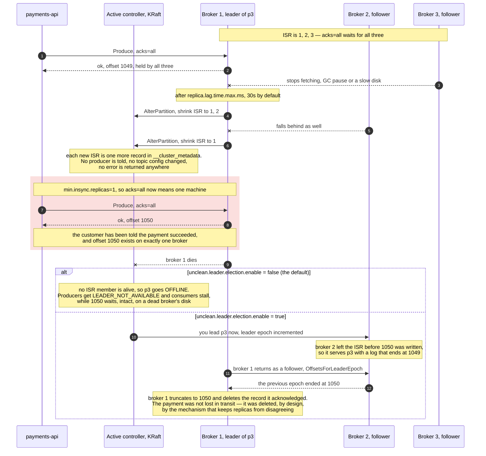

# 04 — ISR, leader election, and what "acknowledged" survives

**The question:** what sequence of events makes a record that Kafka already
acknowledged disappear?

KR1 · no interactive twin yet — this case is the one that justifies every default in
[01](01-write-path.md).

*Fig. 4 — the ISR shrinks in silence and `min.insync.replicas=1` lets `acks=all` keep
returning success from a single machine; what happens to the acknowledged offset 1050 is
then decided by one flag, and neither branch is pleasant: `false` takes the partition
offline, `true` deletes the payment with a routine truncation (exp-04, exp-04b).*

## Who decides what

| Decision | Who makes it | Where it is recorded |
|---|---|---|
| a follower is too slow, shrink the ISR | the partition **leader**, via `AlterPartition` | `__cluster_metadata` |
| a broker is gone, elect a new leader | the **active controller** | `__cluster_metadata` |
| which replica may become leader | the ISR, plus `unclean.leader.election.enable` | topic and broker config |
| where a returning replica truncates | the returning replica, using `leader-epoch-checkpoint` | the partition directory |

In KRaft there is no ZooKeeper. Controller nodes run a Raft quorum, one of them is
active, and cluster metadata is itself a replicated log. Brokers are not told things so
much as they fetch metadata and act on it — which is why a leadership change is visible
to clients as a `NOT_LEADER_OR_FOLLOWER` error plus a metadata refresh, not as a push.

## Why the leader epoch exists

Every leadership change increments the partition's leader epoch. A replica that comes
back compares epochs, finds the offset at which its log diverged, and truncates to it.
Before leader epochs (KIP-101), a returning replica could keep records that were never
committed, and two replicas of the same partition could disagree forever while both
believed they were correct. The `leader-epoch-checkpoint` file in
[02](02-log-segments-retention.md) is that mechanism on disk.

## The three ways an acknowledged record dies

**1. `acks=1` and a leader crash.** The leader answers after its own append. If it dies
before any follower fetches, the record was acknowledged and exists nowhere. Nothing in
the cluster reports this — the offset simply never existed for the new leader.

**2. `acks=all` with a collapsed ISR.** The ISR shrank to one, `acks=all` kept
succeeding, and that one machine died — the red frame in the figure. Reached through a
configuration that reads as safe, and the reason the frame is worth drawing:
`min.insync.replicas=2` is what prevents it, by turning the second `Produce` into a
`NOT_ENOUGH_REPLICAS` rejection so the payment fails loudly instead of vanishing quietly.

Reaching that state on purpose is itself a lesson. On this lab's three nodes each one is
both broker and controller, so killing two to squeeze a `min.insync.replicas=2` topic also
takes the KRaft quorum down — and a cluster with no active controller cannot shrink an ISR
at all, because shrinking it *is* a controller write. The produce then hangs until it times
out, which looks nothing like the rejection the setting is supposed to produce. The
reproducible path is the opposite one: a topic with `min.insync.replicas=3` and a single
broker killed, which drops the ISR below the threshold while two of three controllers stay
alive (exp-08).

**3. Unclean leader election.** This is the second branch of the same figure, and the
distinction matters: on its own, case 2 does not yet destroy anything. With
`unclean.leader.election.enable=false` the partition simply goes offline and offset 1050
is still sitting on the dead broker. The record only dies if that log never comes back —
or if an out-of-sync replica is promoted, which is case 3. Then the promoted replica
becomes the source of truth while missing acknowledged records, and those records are not
"lost in transit": they are deleted from the old leader's log when it returns and
truncates to the new leader's epoch.

With `unclean.leader.election.enable=false` the partition stays **offline** instead.
Availability is sacrificed on purpose: a payment system that cannot write is an
incident, a payment system that silently deletes captures is a disaster. Writing that
trade-off down explicitly is more valuable than the setting itself.

## How to reproduce it honestly

`docker compose kill`, never `stop`. A graceful stop migrates leadership cleanly and
demonstrates nothing — the interesting behaviour only appears when the process dies
without warning.

## Measured

`make exp-04` · [journal](../00-journal.md#exp-04--what-a-dead-broker-costs-and-what-recovery-does-not-do)

One topic, 3 partitions, RF 3, `min.insync.replicas=2`; `docker kill` on the broker leading
partition 0, then a restart, then an explicit preferred election.

| Phase | Leaders | Smallest ISR | Writes accepted, `acks=all` |
|---|---|---|---|
| baseline | `[3 1 2]` | 3 of 3 | 300 of 300 |
| kafka3 killed | `[1 1 2]` | **2**, with `min.insync.replicas` 2 as the broker reports it | **300 of 300** |
| kafka3 back | `[1 1 2]` | 3 of 3 | — |
| after preferred election | `[3 1 2]` | 3 of 3 | — |

| What | Within | Of that, spent polling |
|---|---|---|
| kill → ISR shrinks, partition 0 has a new leader | **10.1 s** | 10.1 s |
| restart → ISR whole again | **5.3 s** | 5.3 s |
| preferred election → leadership back on the preferred replica | **0 s** | 0 s |

Each interval is an upper bound from the event the shell timed; the second column is how
much of it the measuring process spent watching. The first two rows are real intervals. The
third is degenerate — leadership was already back at the first poll — so all this instrument
can say about a preferred election is that it finishes faster than a process can start and
ask.

**The detector is the heartbeat session, not the lag timer — argued, not shown.**
`replica.lag.time.max.ms` (30 s) is the figure usually quoted for a replica leaving the
ISR, and 10.1 s cannot be it. The explanation is that a crashed broker is not a slow
follower: the controller fences a broker whose heartbeats stop after
`broker.session.timeout.ms` — 9 s, heartbeats every 2 s, both
[read off the running broker](../../experiments/exp-04-isr-leader-election/results/broker-timers.log)
— and fencing rewrites the ISR of every partition that broker was in. The lag timer is for a
live follower that has fallen behind. That is two detectors and a good argument for which
one fired; it is not a measurement, because no run here varies either timer. One run with
the session timeout raised would settle it, and is listed below.

**One dead broker, every partition degraded.** RF 3 on three brokers means every broker
holds a replica of every partition, so the under-replicated count went straight to 3 of 3.
On a stand this size that metric is effectively binary.

**Zero margin, and nothing said so.** The degraded window ran with `ISR = min.insync.replicas
= 2` (the instrument reads that setting off the cluster rather than trusting the YAML): every write succeeded, and the next failure is the one that returns
`NOT_ENOUGH_REPLICAS` (exp-08). The alert worth having is on the margin, not on the writes.

**Recovery restores replication, never leadership.** The replica was back in 5.3 s;
partition 0 stayed with its replacement until a preferred election was asked for, which took
0.2 s. `auto.leader.rebalance.enable` is off here on purpose, so that step belongs to
whoever restarts a broker — skipped after each restart, leadership drifts onto the survivors.

## Still to be measured

| Run | What it shows | Status |
|---|---|---|
| exp-04b | `unclean.leader.election.enable=true`: acknowledged records missing after promotion, counted | blocked — see below |
| exp-04c | the same kill with `broker.session.timeout.ms` raised to 20 s: does the reaction time move with it | TBD — this is what turns the detector claim above from an argument into a result |
| exp-08 | `acks=1` vs `acks=all` with `min.insync.replicas=2` under the same kill | TBD |

exp-04b cannot run on this stand. Promoting an out-of-sync replica requires the ISR to
collapse onto one, which on three combined broker/controller nodes means killing two of
them — and with no quorum the controller cannot rewrite an ISR at all, so the produce hangs
instead of demonstrating the flag. Showing it honestly needs controllers separate from
brokers, or five nodes; until then the branch stays a documented consequence rather than a
measured one.
