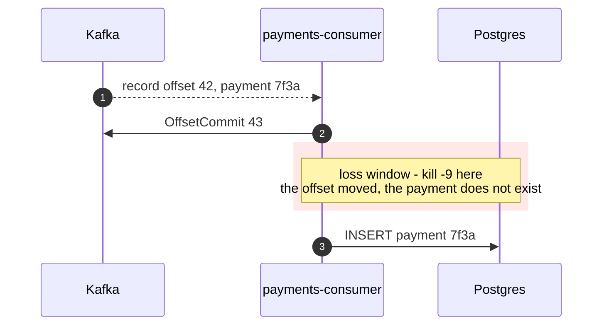
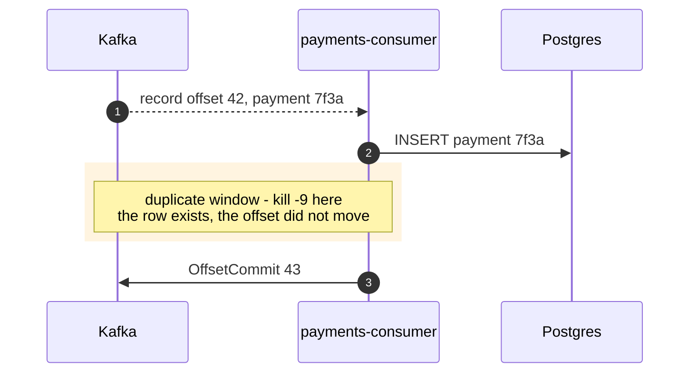
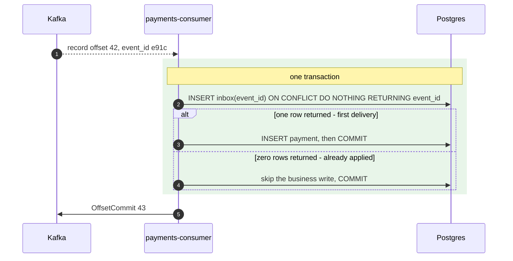

# 05 — Delivery semantics: where the message is lost, doubled, or neither

**The question:** for one record and one database write, where exactly does the failure
window sit — and what closes it?

KR2 · interactive version: [`docs/dynamic/lost-message/`](../dynamic/lost-message/)

Three diagrams, one per outcome. The record, the consumer and the database are identical
in all three. The only thing that moves is the offset commit.

## Case A — at-most-once: commit first

*Fig. 5a — with the commit before the work, a crash inside the marked window deletes a
payment from the system with no error anywhere: the group resumes at 43 and record 42 is
never redelivered (exp-05).*

This is what `enable.auto.commit=true` does by default: it commits offsets that were
handed to the application, on a timer, in the background, regardless of whether the
handler finished. Nothing in the logs marks the loss. The only evidence is a count
mismatch that nobody is counting.

## Case B — at-least-once: process first

*Fig. 5b — with the commit after the work nothing can be lost, and the same crash now
charges the customer twice instead (exp-06).*

This window is not exotic. Rebalances, deploys and OOM kills all land in it routinely,
which is why "at-least-once" should be read as "duplicates, eventually" rather than as a
reassuring phrase. Ordering the two operations correctly does not remove the problem, it
chooses which problem you get.

## Case C — exactly-once effect: let the database decide

*Fig. 5c — the inbox does not stop the duplicate from arriving, it stops the duplicate
from having an effect: delivery is still at-least-once and the broker behaves exactly as
in case B (exp-07).*

**`RETURNING` is the mechanism, not decoration.** `ON CONFLICT DO NOTHING` raises no
error, so the number of returned rows is the *only* signal that this event has been seen
before. An inbox whose result is never checked lets the business write run on every
redelivery — the table exists, the protection does not, and the bug stays invisible
until a rebalance replays a batch. This is the most common way the pattern is
implemented wrongly.

**The two writes must be one transaction.** Splitting the inbox row and the business
write into separate transactions recreates precisely the failure the pattern was
introduced to remove, with an extra table as decoration.

**The event id has to be stable across redeliveries.** It is a property of the event —
generated by the producer, carried in the payload or in a header — never a value the
consumer derives from arrival metadata. Using `topic-partition-offset` as the id looks
equivalent and is not: after a retry-topic hop or a producer resend, the same business
event arrives with a different offset and the inbox lets it through.

## Kafka transactions do not reach Postgres

Exactly-once semantics inside Kafka — a transactional producer doing read-process-write
— make the consumed offsets and the produced records one atomic unit **within Kafka**.
The moment the effect is a row in another database, the guarantee stops at the boundary,
because that database is not part of the transaction.

So for "Kafka plus Postgres" the answer is not EOS. It is an inbox on the way in
(this file) and an outbox on the way out ([06](06-transactional-outbox.md)). Stating
that distinction precisely — *exactly-once effect, at-least-once delivery* — is the
single most useful sentence in the whole KR2 write-up.

## To be measured

| Run | What it shows | Expected shape | Status |
|---|---|---|---|
| exp-05 | at-most-once under `kill -9`: produced vs rows in DB | a small deficit | TBD |
| exp-06 | at-least-once under `kill -9`: produced vs rows in DB | a small surplus | TBD |
| exp-07 | the same failure with the inbox | equal counts, zero duplicates | TBD |
| exp-10 | Kafka EOS read-process-write, then the same run with an external DB write | EOS holds inside Kafka, not across the boundary | TBD |

A small number is the dangerous result here, not a large one: a handful of silently lost
or doubled payments does not look like an incident, it looks like normal traffic.
