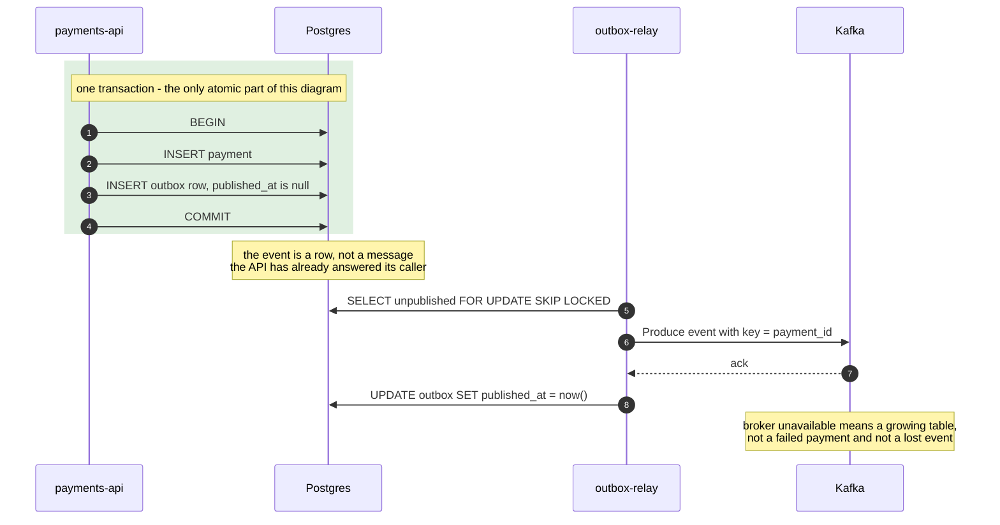
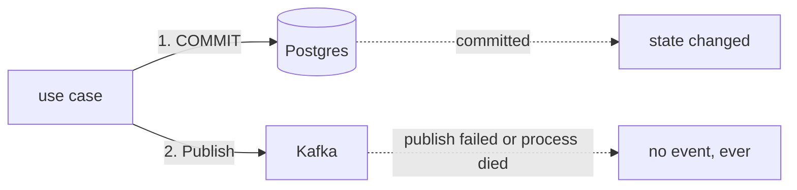

# 06 — Transactional outbox: where atomicity ends

**The question:** the state change and the event must never disagree — but they live in
two different systems, so where exactly does the atomic part stop?

KR3, KR5 · interactive version: [`docs/dynamic/outbox/`](../dynamic/outbox/)

*Fig. 6 — atomicity covers the payment and its event because both are rows in the same
transaction; everything to the right of the commit is retryable delivery, which is why
an unreachable broker degrades latency instead of correctness (exp-10).*

## Why the obvious alternative is a bug

Calling the broker from the use case is a **dual write**: two systems, no shared
transaction, and four possible outcomes instead of two.

*Fig. 6b — the dual write cannot be fixed by ordering or by retrying in the handler: the
process can die between the two arrows, and then the payment exists while the rest of
the company never learns it happened.*

Swapping the order does not help either — publish first and a failed commit announces a
payment that does not exist. The only fix is to stop having two writes: the event
becomes a row.

## What the relay must get right

| Rule | Why | What happens otherwise |
|---|---|---|
| mark `published_at` **only after** the broker ack | the ack is the first moment delivery is real | mark first and a crash loses the event silently — no error, no row to find |
| duplicates after the ack are acceptable | crash between ack and update republishes | harmless, because the consumer has an inbox ([05](05-delivery-semantics.md)) |
| the produce must not hold the row lock for long | `FOR UPDATE` keeps a transaction and a connection open across a network call | a slow broker turns into pool exhaustion in the API; keep batches small, put a hard timeout on the produce, or claim rows with `claimed_by`/`claimed_at` instead of holding the transaction |
| one relay, or partitioned work | two relays publishing events of the same aggregate race each other | `SKIP LOCKED` prevents fighting over rows, not out-of-order publication; fetch batches grouped by `payment_id`, or run a single relay with a lease |
| key every event by aggregate id | ordering in Kafka is per partition | `key=nil` puts `Refunded` and `Captured` on different partitions and the consumer sees them in the wrong order ([01](01-write-path.md)) |

## What it costs, honestly

An extra table, a process to operate and monitor, and events that arrive **after** the
state change rather than with it. The lag of the relay becomes a metric someone has to
watch, and a stuck relay is now a way to lose the *timeliness* of events while keeping
their correctness.

Do not reach for this pattern where a dropped notification is acceptable. Reach for it
where the event is money, an entitlement, or anything another service will treat as
fact. For this lab that is the whole domain, which is why payments were chosen.

## CDC is the same pattern with a different reader

Debezium and friends read the database WAL instead of polling a table. The atomic part
of the diagram is unchanged — it is still one transaction in Postgres — and the relay is
replaced by log-based capture. The trade is: no polling lag and no relay to write,
against an extra piece of infrastructure and a coupling to the physical schema. Worth
naming in the patterns doc; not worth introducing in a lab that has to demonstrate the
mechanism.

## To be measured

| Run | What it shows | Status |
|---|---|---|
| exp-10 | Kafka EOS covers Kafka only; the same run with a Postgres write needs outbox plus inbox | TBD |
| exp-13 | broker killed under load: outbox backlog grows, API keeps answering, relay drains afterwards | TBD |
