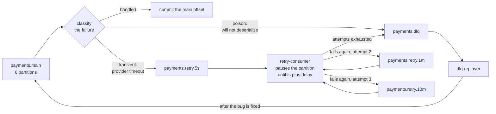
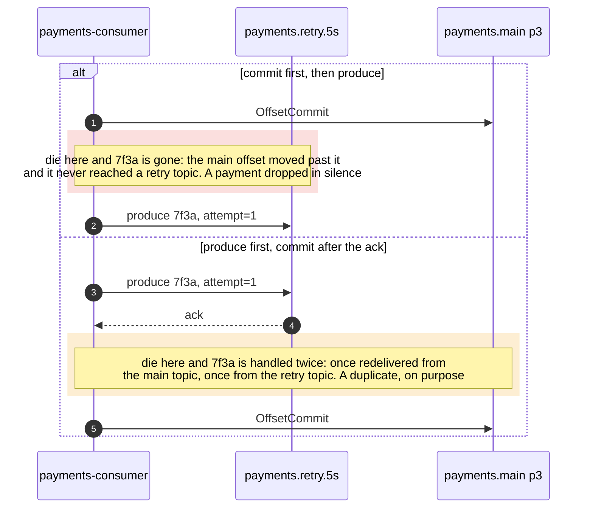

# 07 — Retry chain and dead letters

**The question:** a record fails to process — where does it wait, and who is blocked
while it waits?

KR3 · interactive version: [`docs/dynamic/retry-dlq/`](../dynamic/retry-dlq/)

Two answers to the same failure. The record, the provider and the partition are identical
in both; the only thing that moves is *where the waiting happens*.

## Case A — the wait happens in the handler

*Fig. 7a — sleeping in the handler is the smallest possible change and it converts one
failing merchant into a throughput outage for every payment sharing its partition; the
failure is head-of-line blocking, and its distinguishing feature is that the handler logs
look healthy because the record does eventually succeed (exp-16).*

## Case B — the wait happens in a topic

*Fig. 7b — the same 5 seconds of waiting, moved off the partition that has healthy work
on it: the backoff schedule becomes a list of topics instead of a `sleep`, every route out
of the handler commits the main offset immediately, and the only consumer that ever blocks
is the one whose entire partition is waiting for the same deadline (exp-11).*

**The classification is the first branch for a reason.** Bytes that will not deserialize
skip the chain entirely — see below.

## Why blocking is correct in the retry consumer

Kafka has **no delayed delivery**. The delay is implemented by the retry consumer
reading the record timestamp and pausing the partition until the delay has elapsed.
That is safe here and forbidden in the main consumer for one specific reason: inside
`payments.retry.5s` every record carries the same delay and they arrive in timestamp
order, so waiting for the head record wastes nothing. Mixing delays into one shared
retry topic reintroduces exactly the head-of-line blocking the pattern removes.

Pausing is not the same as sleeping in the handler: the client keeps polling and
heartbeating, so the group does not consider the member dead.

**Watch the timestamp type.** With `message.timestamp.type=LogAppendTime` on the topic,
the broker overwrites the producer timestamp and every delay calculation is wrong. The
retry topics must stay on `CreateTime`, or the delay has to travel in a header.

## The offset on the main topic advances immediately

Moving the record is a produce and freeing the partition is a commit: two systems again,
so the hop out of `payments.main` is a dual write of exactly the shape [06](06-transactional-outbox.md)
is about. It has two orderings and they fail differently.

*Fig. 7c — the retry chain does not remove the dual write, it chooses which side of it to
land on: this pattern manufactures duplicates by design, and it is only correct in a
service that already has the inbox from [05](05-delivery-semantics.md). Building the retry
topics before the inbox is building the failure mode without the thing that absorbs it.*

## What a dead letter must carry

Headers, not a log line: original topic, partition and offset, the error class, the
attempt count, the timestamp of the first failure, and the `trace_id`. That is enough to
reconstruct what happened without digging through consumer logs that have since rotated.

A DLQ you cannot replay from is a rubbish bin. `dlq-replayer` exists so that fixing the
bug and reprocessing is one command, and so that the person doing it at 3 a.m. is not
writing an ad-hoc export script.

## Poison pills skip the queue

Bytes that will not deserialize are not a transient failure. Retrying them a hundred
times changes nothing, and retrying them forever stops the partition permanently — the
consumer never advances past the offset, lag grows without bound, and the topic looks
broken rather than the message. They go straight to the DLQ, the offset is committed,
and a human looks at the bytes later.

Deserialization failure is a support problem. Business-logic failure is a retry problem.
Classifying the error at the boundary is what makes the difference visible in code.

## Retries reorder events by design

A record sent to `payments.retry.10m` comes back long after its neighbours. For payments
that means a handler must never assume arrival order: the state transition is guarded in
the database, `UPDATE ... WHERE status = $expected`, so a stale event finds the row in
the wrong state and changes nothing. Ordering is not restored by the retry chain and
must not be assumed by anything downstream of it.

## To be measured

| Run | What it shows | Status |
|---|---|---|
| exp-11 | poison pill: straight to DLQ and the partition keeps flowing, versus infinite retry and a permanently stuck partition | TBD |
| exp-16 | blocking sleep in the main consumer: lag on the affected partition versus the rest | TBD |
