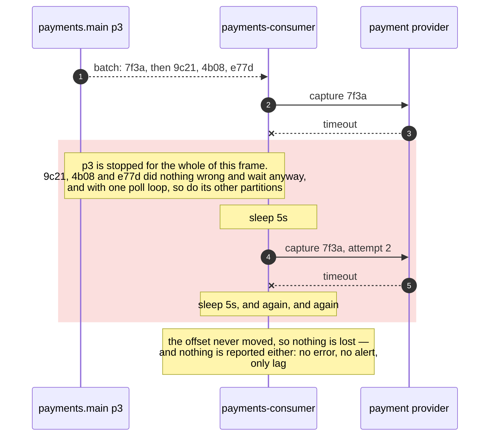
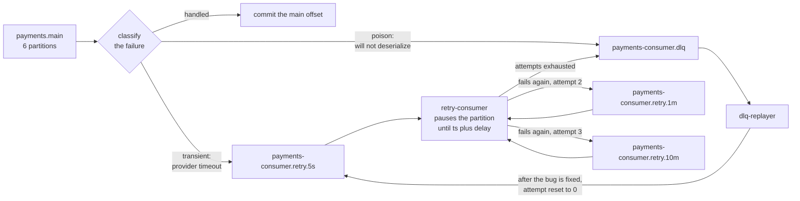

# 07 — Retry chain and dead letters

**The question:** a record fails to process — where does it wait, and who is blocked
while it waits?

KR3 · interactive version: [`docs/dynamic/retry-dlq/`](../dynamic/retry-dlq/)

Two answers to the same failure. The record, the provider and the partition are identical
in both; the only thing that moves is *where the waiting happens*.

## Case A — the wait happens in the handler

*Fig. 7a — sleeping in the handler is the smallest possible change and it converts one
failing merchant into a throughput outage for every payment sharing its partition — and,
with a single poll loop, every partition the consumer owns. The failure is head-of-line
blocking, and its distinguishing feature is that the handler logs look healthy because the
record does eventually succeed. exp-16 measured the outage version of it; the one slow
merchant among healthy ones is argued, not run.*

## Case B — the wait happens in a topic

*Fig. 7b — the same 5 seconds of waiting, moved off the partition that has healthy work
on it: the backoff schedule becomes a list of topics instead of a `sleep`, every route out
of the handler commits the main offset immediately, and the only consumer that ever blocks
is the one whose entire partition is waiting for the same deadline (exp-11). Every topic
in the chain is named after the consumer group, not after `payments.main`, and the
replay goes back into the group's own first tier — see below for why.*

**The classification is the first branch for a reason.** Bytes that will not deserialize
skip the chain entirely — see below.

## Why blocking is correct in the retry consumer

Kafka has **no delayed delivery**. The delay is implemented by the retry consumer
reading the record timestamp and pausing the partition until the delay has elapsed.
That is safe here and forbidden in the main consumer for one specific reason: inside
`payments-consumer.retry.5s` every record carries the same delay and the broker stamps
them in the order they arrive, so waiting for the head record wastes nothing. Mixing
delays into one shared retry topic reintroduces exactly the head-of-line blocking the
pattern removes.

Pausing is not the same as sleeping in the handler: the client keeps polling and
heartbeating, so the group does not consider the member dead.

**The delay is counted from the moment a record entered the tier, so the tiers run on
`LogAppendTime`.** The retry consumer forwards the record it received, and a forwarded
record still carries the timestamp of the original event: franz-go only stamps
`time.Now()` on a record whose timestamp is zero. On a `CreateTime` topic that makes
"timestamp plus five seconds" long past on arrival, the delay silently becomes zero, and
three attempts burn through in milliseconds against a provider that is still down. With
`LogAppendTime` the broker overwrites the timestamp with the append time, which is
exactly the start of the wait. Checked on this stand: a record forwarded with an
hour-old timestamp read back an hour old from a `CreateTime` topic and zero seconds old
from a `LogAppendTime` one. The original event time is not lost — it travels in a header,
next to the time of the first failure.

## The offset on the main topic advances immediately

Moving the record is a produce and freeing the partition is a commit: two systems again,
so the hop out of `payments.main` is a dual write of exactly the shape [06](06-transactional-outbox.md)
is about. It has two orderings and they fail differently.

*Fig. 7c — the retry chain does not remove the dual write, it chooses which side of it to
land on: this pattern manufactures duplicates by design, and it is only correct in a
service that already has the inbox from [05](05-delivery-semantics.md). Building the retry
topics before the inbox is building the failure mode without the thing that absorbs it.*

## The chain belongs to the consumer group, not to the topic

A retry is a second attempt by *one handler*, so the tiers and the dead-letter topic are
named after the consumer group — `payments-consumer.retry.5s`, `payments-consumer.dlq` —
and the source topic travels in a header. A chain named after `payments.main` works only
while exactly one group reads it. The moment a second group appears, say an enricher,
three things break at once. Its failures land in a tier read by `payments-consumer`, which
finds the `event_id` in its own inbox and "succeeds" at doing nothing, so the enricher's
work is never retried and nothing reports it. The replayer writes back into
`payments.main`, so every group receives the replay, and one without an inbox counts the
revenue twice. And an alert that the DLQ is growing no longer says whose service is
broken. This is the layout Uber describes for the same pattern: independent work streams
on the same event each get their own reprocessing and dead-letter queues.

For the same reason the replayer never writes into `payments.main`. It writes into the
group's own first tier with the attempt count reset, so the replay reaches only the
handler that failed.

## What a dead letter must carry

The key and the value are copied byte for byte through every tier, into the DLQ and back
out of it on replay; only headers are added. A replayer that writes with a null key
scatters one payment's events across partitions, and one that re-serialises the value
registers a new schema subject for every tier ([09](09-schema-evolution.md)).

The headers carry what a log line would have: original topic, partition and offset, the
error class, the attempt count, the original event time, the time of the first failure,
and the `trace_id`. That is enough to reconstruct what happened without digging through
consumer logs that have since rotated. The error text is truncated to a kilobyte and never
includes a stack trace: a dead letter is the original record plus its headers, and one
that outgrows `max.message.bytes` cannot be written to the DLQ at all — the poison pill
returns as a stuck partition.

A DLQ you cannot replay from is a rubbish bin. `dlq-replayer` exists so that fixing the
bug and reprocessing is one command, and so that the person doing it at 3 a.m. is not
writing an ad-hoc export script.

## How long each topic keeps its records

Retention is set per topic, deliberately, because the default of seven days answers none
of the questions below.

| Topic | Retention | Why |
|---|---|---|
| `payments.main` | 7 days | Postgres is the system of record; the topic is the transport and a week of replay buffer |
| `payments-consumer.retry.*` | 7 days | not the delay — how long the retry consumer may be down before a payment in flight is deleted |
| `payments-consumer.dlq` | 30 days | the window for fix, release and replay; a bug fixed on a two-week release train must still find its letters |

The DLQ also runs on `LogAppendTime` for a second reason: retention deletes a segment by
its newest timestamp, and a dead letter forwarded with its original timestamp would start
the clock at the event's birth rather than at its death. It deliberately has no
`retention.bytes`: a storm of poison records must not silently push payments out by size.
One gap remains for the replayer itself: it runs on demand, and a group idle for longer
than `offsets.retention.minutes` (seven days here) loses its committed offsets, so a
replayer that trusts its group offset would replay everything from the start.

## Poison pills skip the queue

Bytes that will not deserialize are not a transient failure. Retrying them a hundred
times changes nothing, and retrying them forever stops the partition permanently — the
consumer never advances past the offset, lag grows without bound, and the topic looks
broken rather than the message. They go straight to the DLQ, the offset is committed,
and a human looks at the bytes later.

Deserialization failure is a support problem. Business-logic failure is a retry problem.
Classifying the error at the boundary is what makes the difference visible in code.

## Retries reorder events by design

A record sent to `payments-consumer.retry.10m` comes back long after its neighbours, and
that produces two different wrong orders, not one. The state transition is guarded in the
database, `UPDATE ... WHERE status = $expected`, and the handler has to tell the two apart
by which side of the expected state the row is on:

- **The row is already past the expected state** — a *stale* event: the transition it
  carries has been applied. Note this cannot be its own predecessor coming back late, since
  the rule below keeps a successor behind it; it is a second copy of an applied transition
  under a different `event_id` — the provider reporting one authorization twice, say — which
  the inbox does not deduplicate. It changes nothing and is acknowledged.
- **The row is still behind the expected state** — a *premature* event: `Authorized` went
  to `retry.1m`, `Captured` arrived next and finds the payment still `Requested`. Treating
  this as "wrong state, change nothing" loses the capture. It is a retriable error and goes
  into the chain after its predecessor.

Because the key survives every hop, the premature event lands in the same partition as its
predecessor and, inside a tier, behind it. The residual risk is worth stating: if the
successor exhausts its attempts before the predecessor does, it reaches the DLQ first, so
the replay has to follow the offsets of a key, not the order of the letters. The stricter
alternative is to park the key — while any event of a payment sits in the chain, every
later event of the same payment goes straight in behind it. Ordering is not restored by
the retry chain and must not be assumed by anything downstream of it.

## The chain is for one failing record, not for an outage

The chain gives a record about eleven minutes: five seconds, a minute, ten minutes. When the
provider is down for an hour, every payment walks the whole chain, the entire flow is in the
DLQ eleven minutes in, and on the way the recovering provider receives four attempts for
every payment — a retry storm. A systemic failure is handled one step earlier: a circuit
breaker around the provider opens, and the main consumer pauses its partitions
(`PauseFetchPartitions`) instead of feeding the chain. That is backpressure, and exp-16
measured it against the inline retry through a 20 s outage: the same lag, but no member
removed, no commit rewound and nothing handled twice, where the inline retry had its member
removed and a stale commit rewind a partition 1 726–1 732 records. The retry chain stays for what it is good at: one record failing among
healthy ones.

## To be measured

| Run | What it shows | Status |
|---|---|---| exp-11 | poison pill: straight to DLQ and the partition keeps flowing, versus infinite retry and a permanently stuck partition | **measured**: with no dead letter route, 10 of 100 payments counted, the offset stuck at 10, 91 records never read, and 124–125 consumer restarts in 30 s. With one, all 100 counted and the record archived, in 207–322 ms ([exp-11](../../experiments/transaction_guarantee/exp-11-poison-pill/)) |
| exp-16 | a 20 s outage with a member joining mid-way: retry inline, holding the batch, against pause-and-rewind | **measured**: the same lag, 7 940–8 501 records, either way. Inline: the member removed after the 8 s rebalance timeout, one commit refused, its next commit rewinding a partition 1 726–1 732 records, 1 739 handled twice in one run of three. Paused: none of that ([exp-16](../../experiments/transaction_guarantee/exp-16-lag-backpressure/)) |
| one slow merchant among healthy ones | a single poll loop stalls every partition the member owns, not only the slow one's | not run — argued from the loop |
