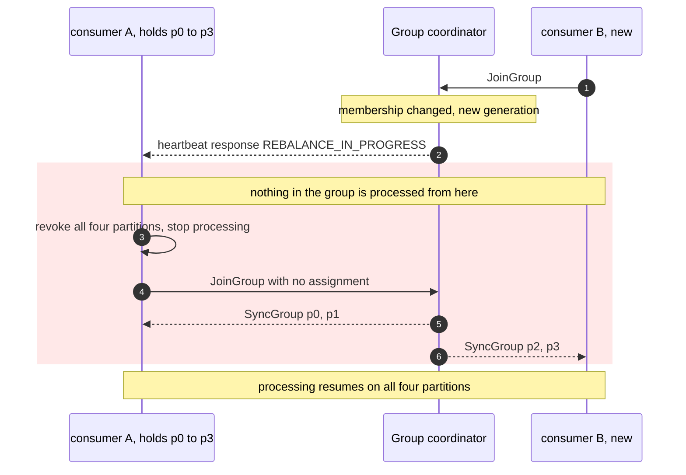
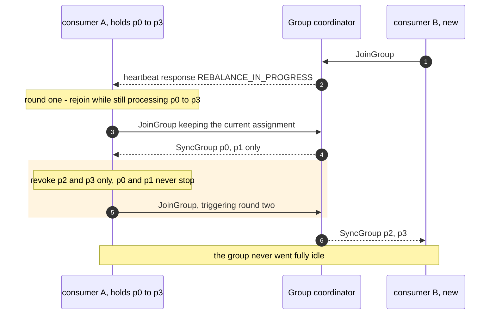

# 08 — Rebalance: eager versus cooperative

**The question:** a consumer joins the group — how long does the group stop making
progress?

KR2, KR4 · interactive version: [`docs/dynamic/rebalance/`](../dynamic/rebalance/)

The number that matters is **downtime**, not how often the group rebalances. A group
that rebalances often and never stalls is healthier than one that rebalances rarely and
freezes for thirty seconds when it does.

## Case A — eager: stop the world

*Fig. 8a — with the `range` or `roundrobin` assignors every member gives up every
partition, including the ones it is about to receive straight back, so downtime scales
with the size of the group rather than with how much actually moved (exp-14).*

Adding one consumer to a group of ten stops all ten. The revoked-and-immediately-
regranted partitions are pure waste, and they are the majority of the movement in any
group larger than two.

## Case B — cooperative: revoke only what moves

*Fig. 8b — `cooperative-sticky` pays one extra rebalance round to keep every partition
that is not moving in service, so downtime tracks the partitions actually transferred
instead of the size of the group (exp-14).*

The trade is one extra round trip against near-zero processing downtime, and it is
almost always worth taking.

**Switching assignors on a running group is a rolling upgrade, not a config flip.** The
members must first be deployed with both the old and the new assignor configured, then
deployed again with the old one removed. Flipping straight to `cooperative-sticky`
across a live group leaves members unable to agree on a protocol.

## What actually triggers a rebalance

| Trigger | Avoidable? |
|---|---|
| a member joins or leaves | no — this is the point of a group |
| a pod restarts during a deploy | yes, mostly: `group.instance.id` (static membership) plus a `session.timeout.ms` longer than the restart keeps the member's assignment through a bounce |
| a member is fenced for being slow | yes: fix the handler, or size the rebalance timeout for the real p99 — see [03](03-read-path.md) |
| the coordinator broker dies | no, but it is rarer than the other three |
| a topic gains partitions or a subscription changes | no |

Static membership is the highest-value item in this table for a service that deploys
several times a day: without it, every rolling deploy is a rebalance per pod.

## What to measure, and what not to report

Rebalance frequency alone says nothing. The number worth reporting is **processing
downtime**: the interval during which the group produced no committed progress at all.
exp-14 runs both assignors under identical load and records the gap between the
revocation and the first commit after the new assignment.

| Run | Metric | Status |
|---|---|---|
| exp-14 eager | downtime per rebalance, group of N | TBD |
| exp-14 cooperative | downtime per rebalance, same load | TBD |
| exp-14 | rebalances per rolling deploy with and without `group.instance.id` | TBD |

## Protocol version warning

Everything above is the **classic** protocol: `JoinGroup`, `SyncGroup`, generations, and
an assignment computed by an elected member. KIP-848, GA in Kafka 4.0, replaces it with
incremental broker-side assignment over `ConsumerGroupHeartbeat` — which changes the
mechanics of both diagrams, though not the metric that matters. Confirm which protocol
the pinned client negotiates before quoting either version.
