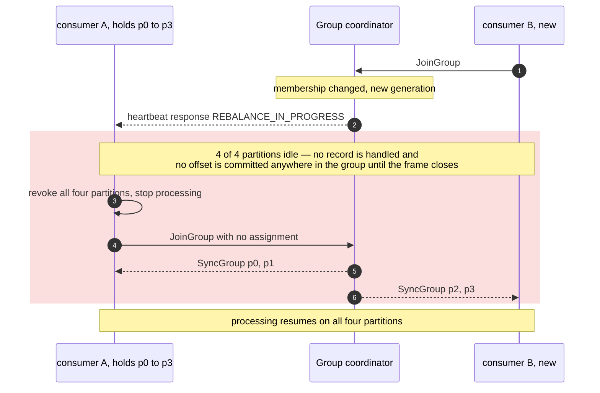
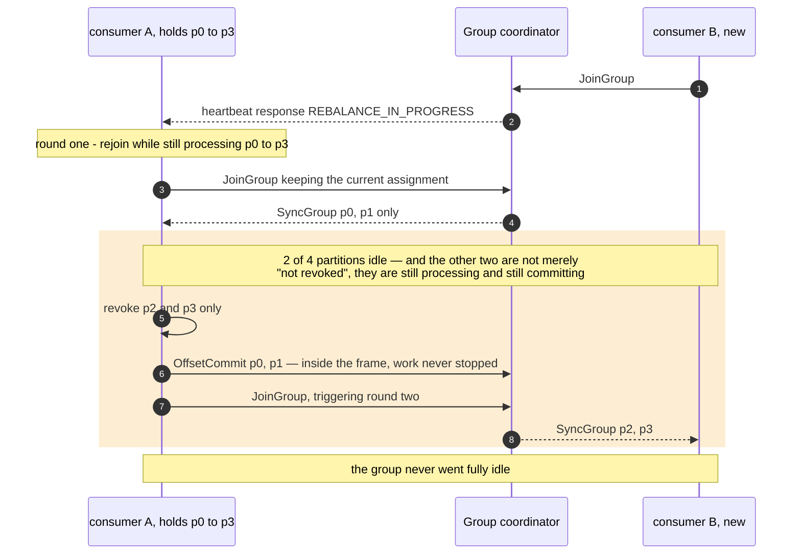

# 08 — Rebalance: eager versus cooperative

**The question:** a consumer joins the group — how long does the group stop making
progress?

KR2, KR4 · interactive version: [`docs/dynamic/rebalance/`](../dynamic/rebalance/)

The number that matters is **downtime**, not how often the group rebalances. A group
that rebalances often and never stalls is healthier than one that rebalances rarely and
freezes for thirty seconds when it does.

## Case A — eager: stop the world

*Fig. 8a — with the `range` or `roundrobin` assignors every member gives up every
partition, including the ones it is about to receive straight back, so downtime scales
with the size of the group rather than with how much actually moved. exp-14 saw every
partition revoked; the scaling with group size is argued — its group had two members.*

Adding one consumer to a group of ten stops all ten. The revoked-and-immediately-
regranted partitions are pure waste, and they are the majority of the movement in any
group larger than two.

## Case B — cooperative: revoke only what moves

*Fig. 8b — `cooperative-sticky` pays one extra rebalance round to keep every partition
that is not moving in service, so downtime tracks the partitions actually transferred
instead of the size of the group. The `OffsetCommit` drawn inside the frame is the entire
difference between the two figures: progress during a rebalance. exp-14 observes it as
records still being handled on the partitions that did not move.*

The trade is one extra round against keeping every unmoved partition in service. exp-14
measured what the extra round costs in franz-go: the client notices it with a heartbeat
500 ms after the first, so the moved partitions stopped for 0.52–0.68 s while the three
that stayed kept flowing at their baseline. Eager, in the same two-member group, stopped all
six for only 39–75 ms — a round that small costs less than cooperative's wait. Cooperative wins where
eager's round is long: many members, slow handlers, real network latency — none of which
this stand has, so that side is argued, not measured.

**Both frames are measured the same way**, or the comparison is worthless: each one opens
at the revocation and closes when the new owner has actually been handed the partitions.
The eager frame is that interval for the whole group; the cooperative frame is that
interval for the two partitions that moved, while p0 and p1 keep committing throughout.

Both diagrams also collapse one step that [03](03-read-path.md) draws in full: the plan
still comes from the **group leader**, an ordinary member, and the coordinator only
distributes it. Nothing about assignment moved onto the broker in either case.

**The client defaults are not the same, and exp-14 depends on it.** Java's
`partition.assignment.strategy` defaults to `[range, cooperative-sticky]`, which
negotiates down to eager `range`; franz-go's `Balancers` default is
`CooperativeStickyBalancer()`. So Case A is what a Java service gets for free and what a
franz-go service has to be told to do — exp-14 must configure the eager balancer
explicitly, or it will measure cooperative twice and find no difference.

**Switching assignors on a running group is a rolling upgrade, not a config flip.** The
members must first be deployed with both the old and the new assignor configured, then
deployed again with the old one removed. Flipping straight to `cooperative-sticky`
across a live group leaves members unable to agree on a protocol.

## What actually triggers a rebalance

| Trigger | Avoidable? |
|---|---|
| a member joins or leaves | no — this is the point of a group |
| a pod restarts during a deploy | yes, mostly: `group.instance.id` (static membership) plus a `session.timeout.ms` longer than the restart keeps the member's assignment through a bounce |
| a member is fenced for being slow | yes: fix the handler, or size the rebalance timeout for the real p99 — see [03](03-read-path.md) |
| the coordinator broker dies | no, but it is rarer than the other three |
| a topic gains partitions or a subscription changes | no |

Static membership is the highest-value item in this table for a service that deploys
several times a day: without it, every rolling deploy is a rebalance per pod.

## What to measure, and what not to report

Rebalance frequency alone says nothing. The number worth reporting is **processing
downtime**, and exp-14 measures it per partition: the longest stretch in which nothing of
that partition was handled, around a second member joining, against the same measure
taken before the join. Handling rather than commits, because a commit only shows that
handling happened earlier.

| Run | Metric | Result |
|---|---|---|
| exp-14 eager | per-partition stop when a member joins a group of one | **all six revoked, 39–75 ms each** — no longer than a steady-state poll cycle ([exp-14](../../experiments/transaction_guarantee/exp-14-rebalance-strategies/)) |
| exp-14 cooperative | the same | **three moved, 0.52–0.68 s; three stayed, at their baseline** |
| exp-14 KIP-848 | the same | **three moved, 4.9–6.5 s, around the consumer heartbeat interval; three stayed, at their baseline** |
| eager in a large group or with slow handlers | per-partition stop | not measured — two members on a local network cannot show it |
| static membership | rebalances per rolling deploy with and without `group.instance.id` | not measured |

## Protocol version warning

Everything above is the **classic** protocol: `JoinGroup`, `SyncGroup`, generations, and
an assignment computed by an elected member. KIP-848, GA in Kafka 4.0, replaces it with
incremental broker-side assignment over `ConsumerGroupHeartbeat` — which changes the
mechanics of both diagrams, though not the metric that matters. franz-go speaks it with
`kgo.ServerSideBalancer`, and exp-14 ran it: the moved partitions change hands on the
consumer heartbeat, `group.consumer.heartbeat.interval.ms`, 5 s by default, so they waited
4.9–6.5 s — longer than either classic assignor here — while the unmoved ones kept flowing
at their baseline.
