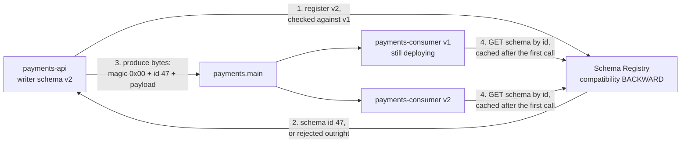

# 09 — Schema evolution: who gets upgraded first

**The question:** a field is added to `PaymentCaptured` — who has to be deployed first,
the producers or the consumers, and who decides?

KR3 · no interactive twin: the mechanism is a decision table, not a sequence.

*Fig. 9 — compatibility is enforced once, when a schema is registered, and never at read
time: the bytes on the wire carry a schema id, so a consumer that cannot resolve that id
fails on the first byte rather than on a missing field (exp-12).*

## The wire format is not bare Avro or bare Protobuf

| Bytes | Content |
|---|---|
| 0 | magic byte `0x00` |
| 1–4 | schema id, big-endian int32 |
| 5+ | the serialized payload (for Protobuf, preceded by a varint message-index array) |

Never assemble this by hand — use `franz-go/pkg/sr`. The symptom of getting it wrong is
distinctive and initially baffling: the consumer fails immediately, on the first byte,
with a decode error that mentions nothing about schemas.

## The direction table — this is the part people get backwards

The compatibility **mode** is a registry-level rule about which direction must hold. It
means the same thing for every format:

| Mode | Guarantee | Deploy order |
|---|---|---|
| `BACKWARD` (default) | a **new** schema can read data written with the **previous** one | **consumers first** |
| `FORWARD` | the **previous** schema can read data written with the **new** one | **producers first** |
| `FULL` | both directions against the previous version | either order |
| `*_TRANSITIVE` | the same, checked against **all** previous versions, not only the last | as above |
| `NONE` | nothing is checked | there is no safe order |

Read the middle column as the operational instruction it is: `BACKWARD` means the new
consumers must already be running when the new producers start, because the guarantee is
"a new reader can handle old data" and says nothing about an old reader handling new
data.

## Which *changes* satisfy a mode depends on the format

This is the part that gets copied from an Avro blog post into a Protobuf project and
quietly stops being true. This lab serialises with **Protobuf (proto3)**, so the right
column is the one that applies here.

| Change | Avro | Protobuf (proto3) |
|---|---|---|
| add a field **with** a default | backward compatible | n/a — proto3 has no defaults and no `required`: every field is optional on the wire |
| add a field **without** a default | **rejected** under `BACKWARD` | n/a — the concept does not exist; adding a field is compatible in both directions |
| delete a field | allowed under `BACKWARD`, rejected under `FORWARD`/`FULL` | allowed by the checker — an old reader treats it as an unknown field |
| change a field's type | rejected | rejected (`FIELD_SCALAR_KIND_CHANGED`) |
| rename a field | rejected unless an alias is declared | wire format is tag-based, so the checker allows it — JSON mapping breaks, the binary payload does not |
| **reuse a deleted field number** | n/a | the real danger: structurally valid, silently decodes old bytes into the new field. Only `reserved` prevents it, and only if you remember to write it |

Two consequences worth stating out loud in the write-up:

- **In Protobuf almost everything passes.** The checker cannot protect you from field
  number reuse unless the deleted numbers are marked `reserved`. "The registry accepted
  it" is a much weaker statement here than it is under Avro, and treating the two as
  equivalent is the actual trap.
- **A v1 consumer reading v2 data is forward compatibility**, which `BACKWARD` does not
  promise. In Protobuf it happens to work for added fields because unknown fields are
  ignored (and, since proto3.5, preserved on re-serialisation) — it works despite the
  mode, not because of it. If the requirement really is "old consumers keep working while
  producers roll ahead", set `FULL` deliberately rather than inheriting the default.

## To be measured

Every verdict below is what the pinned registry version is *expected* to return. The
protobuf checker's exact behaviour has moved between releases, so exp-12 records what it
actually did, against a pinned image — that recorded matrix is the deliverable, not this
table.

| Run | Change under test | Mode | Expected verdict | Status |
|---|---|---|---|---|
| exp-12a | add a new singular field `refund_reason` | `BACKWARD` | accepted | TBD |
| exp-12b | change `amount_minor` from `int64` to `string` | `BACKWARD` | rejected | TBD |
| exp-12c | delete a field, no `reserved` | `BACKWARD` | accepted — and this is the trap, not the success | TBD |
| exp-12d | reuse the deleted field number with a different type | `BACKWARD` | registry verdict recorded, plus what a v1 consumer decodes from those bytes | TBD |
| exp-12e | a v1 consumer reads v2 data after 12a | — | decodes, unknown field ignored | TBD |
| exp-12f | delete a field | `FULL` | registry verdict recorded | TBD |

## Licensing, because it is a real question

`cp-schema-registry` is distributed under the **Confluent Community License**, not
Apache 2.0. For a lab it is irrelevant; for a client's production stack it is a
procurement conversation, and knowing the answer before being asked lands better than
the integration code does. The Apache 2.0 alternative is **Apicurio Registry**, which
speaks the same Confluent-compatible REST API and the same wire format.
