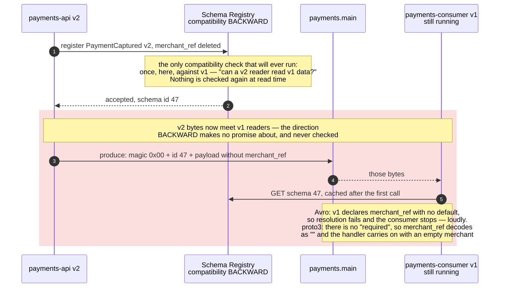
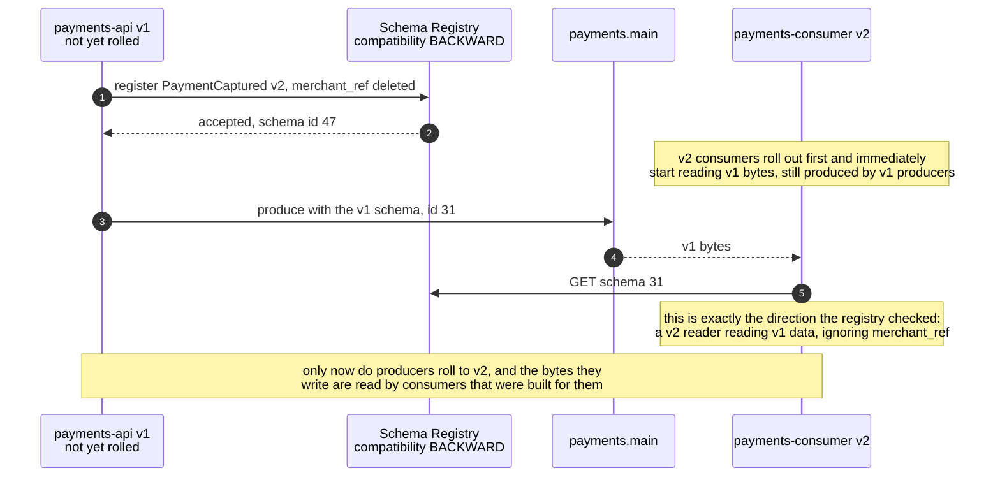
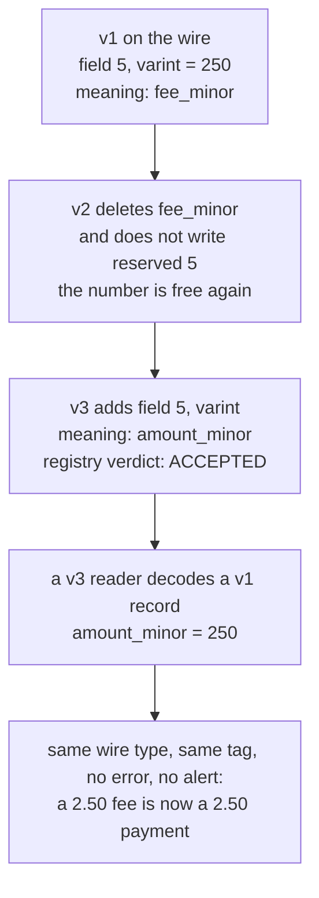

# 09 — Schema evolution: who gets upgraded first

**The question:** a field is added to `PaymentCaptured` — who has to be deployed first,
the producers or the consumers, and who decides?

KR3 · no interactive twin: the answer is a deploy order and a decision table, and both
read better sitting still.

The change under test in both figures is the one the registry is happiest to accept:
**`merchant_ref` is deleted from `PaymentCaptured`**. Under `BACKWARD` that is a legal
change — a v2 reader can read v1 data, because it simply ignores a field it no longer
knows about. Nothing in that sentence says anything about a v1 reader.

## Case A — producers deployed first

*Fig. 9a — the registry's verdict covers one direction only, so deploying producers first
under `BACKWARD` opens a window it never examined; the two formats fail it differently, and
the Protobuf ending is the worse one because nothing anywhere reports a problem (exp-12c,
exp-12e2).*

## Case B — consumers deployed first

*Fig. 9b — same change, same registry setting, no window at all: `BACKWARD` is not a
property of the schema, it is an instruction about deploy order, and this is what obeying
it looks like (exp-12).*

## The wire format is not bare Avro or bare Protobuf

| Bytes | Content |
|---|---|
| 0 | magic byte `0x00` |
| 1–4 | schema id, big-endian int32 |
| 5+ | the serialized payload (for Protobuf, preceded by a varint message-index array) |

Never assemble this by hand — use `franz-go/pkg/sr`. The symptom of getting it wrong is
distinctive and initially baffling: the consumer fails immediately, on the first byte,
with a decode error that mentions nothing about schemas.

## Subjects: one topic, four event types

The figures above register `PaymentCaptured` as if it owned its subject. With the default
`TopicNameStrategy` it does not: the subject is `payments.main-value`, and every schema
registered under it is checked against the one before. `payments.main` carries four event
types — requested, authorized, captured, refunded — and they have to share it, because
splitting them across topics would give up the per-payment ordering the key exists for.
Registering `PaymentAuthorized` into that subject would then be judged against
`PaymentCaptured`.

The value is therefore one envelope, `PaymentEvent { oneof event { … } }`, under
`TopicNameStrategy`, and a new event type is a new `oneof` variant — which the registry
should accept as compatible, a verdict exp-12 records from a run against the pinned
registry image rather than from memory. Three more rules follow from the same wire format:

- **The retry tiers and the DLQ forward bytes verbatim** — magic byte, schema id and
  payload untouched — and no subject is registered for them. A forwarder that decoded and
  re-encoded would create `payments-consumer.retry.5s-value` and friends, each with a
  compatibility history of its own, and a poison record could not be forwarded at all.
- **A DLQ may contain bytes that do not decode.** That is its job for a poison pill
  ([07](07-retry-dlq.md), exp-11), so nothing downstream may assume every dead letter
  parses.
- **The key is the plain UTF-8 bytes of `payment_id`, never registry-encoded.** The key is
  what the partitioner hashes; a schema id inside it would move a payment to a different
  partition the day the key's schema evolved.

## The direction table — this is the part people get backwards

The compatibility **mode** is a registry-level rule about which direction must hold. It
means the same thing for every format:

| Mode | Guarantee | Deploy order |
|---|---|---|
| `BACKWARD` (default) | a **new** schema can read data written with the **previous** one | **consumers first** |
| `FORWARD` | the **previous** schema can read data written with the **new** one | **producers first** |
| `FULL` | both directions against the previous version | either order |
| `*_TRANSITIVE` | the same, checked against **all** previous versions, not only the last | as above |
| `NONE` | nothing is checked | there is no safe order |

Read the middle column as the operational instruction it is: `BACKWARD` means the new
consumers must already be running when the new producers start, because the guarantee is
"a new reader can handle old data" and says nothing about an old reader handling new
data.

## Which *changes* satisfy a mode depends on the format

This is the part that gets copied from an Avro blog post into a Protobuf project and
quietly stops being true. This lab serialises with **Protobuf (proto3)**, so the right
column is the one that applies here.

| Change | Avro | Protobuf (proto3) |
|---|---|---|
| add a field **with** a default | backward compatible | n/a — proto3 has no defaults and no `required`: every field is optional on the wire |
| add a field **without** a default | **rejected** under `BACKWARD` | n/a — the concept does not exist; adding a field is compatible in both directions |
| delete a field | allowed under `BACKWARD`, rejected under `FORWARD`/`FULL` | allowed by the checker — an old reader treats it as an unknown field |
| change a field's type | rejected | rejected (`FIELD_SCALAR_KIND_CHANGED`) |
| rename a field | rejected unless an alias is declared | wire format is tag-based, so the checker allows it — JSON mapping breaks, the binary payload does not |
| **reuse a deleted field number** | n/a | the real danger: structurally valid, silently decodes old bytes into the new field. Only `reserved` prevents it, and only if you remember to write it |

The last row is the only change in this file that no deploy order can save you from, so it
gets its own figure:

*Fig. 9c — every arrow here is legal, the registry accepts the change, and there is no
deploy order that helps: reuse of a field number with the same wire type is the one
Protobuf failure that produces plausible wrong numbers instead of an error, and `reserved`
is the only thing that prevents it (exp-12d).*

Two consequences worth stating out loud in the write-up:

- **In Protobuf almost everything passes.** The checker cannot protect you from field
  number reuse unless the deleted numbers are marked `reserved`. "The registry accepted
  it" is a much weaker statement here than it is under Avro, and treating the two as
  equivalent is the actual trap.
- **A v1 consumer reading v2 data is forward compatibility**, which `BACKWARD` does not
  promise. In Protobuf it happens to work for added fields because unknown fields are
  ignored (and, since proto3.5, preserved on re-serialisation) — it works despite the
  mode, not because of it. If the requirement really is "old consumers keep working while
  producers roll ahead", set `FULL` deliberately rather than inheriting the default.

## To be measured

Every verdict below is what the pinned registry version is *expected* to return. The
protobuf checker's exact behaviour has moved between releases, so exp-12 records what it
actually did, against a pinned image — that recorded matrix is the deliverable, not this
table.

| Run | Change under test | Mode | Expected verdict | Status |
|---|---|---|---|---|
| exp-12a | add a new singular field `refund_reason` | `BACKWARD` | accepted | TBD |
| exp-12b | change `amount_minor` from `int64` to `string` | `BACKWARD` | rejected | TBD |
| exp-12c | delete a field, no `reserved` | `BACKWARD` | accepted — and this is the trap, not the success | TBD |
| exp-12d | reuse the deleted field number, **same wire type**, new meaning (Fig. 9c) | `BACKWARD` | registry verdict recorded, plus the number a v3 consumer decodes out of v1 bytes | TBD |
| exp-12d2 | the same reuse with a **different** wire type | `BACKWARD` | recorded — expected to be the less dangerous variant, because a wire-type mismatch is visible to the decoder | TBD |
| exp-12e | a v1 consumer reads v2 data after 12a | — | decodes, unknown field ignored | TBD |
| exp-12e2 | a v1 consumer reads v2 data after 12c (Fig. 9a) | — | proto3: decodes with `merchant_ref` empty, no error raised anywhere — the ending this file exists to make visible | TBD |
| exp-12f | delete a field | `FULL` | registry verdict recorded | TBD |

## Licensing, because it is a real question

`cp-schema-registry` is distributed under the **Confluent Community License**, not
Apache 2.0. For a lab it is irrelevant; for a client's production stack it is a
procurement conversation, and knowing the answer before being asked lands better than
the integration code does. The Apache 2.0 alternative is **Apicurio Registry**, which
speaks the same Confluent-compatible REST API and the same wire format.
