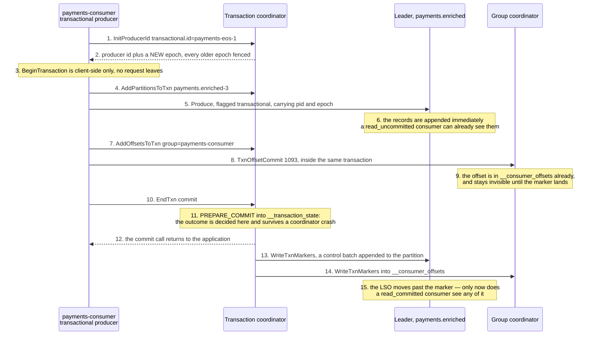

# 10 — Transactions and exactly-once: what the atomic unit really is

**The question:** a Kafka transaction makes a read-process-write loop atomic — atomic
across *what*, exactly, and where does that stop?

KR2 · no interactive twin: this one is a protocol, and the interesting part is which
requests go to which coordinator — a table reads better than an animation.

*Fig. 10 — a Kafka transaction is a two-phase commit whose participants are all inside
Kafka: the output records and the consumed offsets become visible together, when the
markers land; nothing on this diagram can reach a row in Postgres (exp-10).*

## What each step really is

The numbers are written in by hand, because steps 3, 6, 9, 11 and 15 are the ones that
matter and `autonumber` counts only arrows.

| # | What actually happens | What breaks if you get it wrong |
|---|---|---|
| 1–2 | The coordinator is the broker leading the `__transaction_state` partition that `transactional.id` hashes to — a **different** coordinator from the group's, reached by a different hash. Bumping the epoch fences every previous incarnation of that id and rolls back whatever it left open. | A `transactional.id` generated fresh on each start fences nothing and recovers nothing: it is a new producer every time, and the zombie it was supposed to fence keeps writing. The id must be stable across restarts for the same logical worker. |
| 3 | No network call. The transaction begins the moment the client says so. | Timing a "transaction start" in a trace and finding nothing on the wire. |
| 4 | Every partition has to be registered with the coordinator **before** the first record goes to it, so the coordinator knows where to send markers later. | Nothing, if you use a client. It is why the first produce to a new partition inside a transaction costs an extra round trip, which is where per-transaction overhead comes from. |
| 5–6 | Transactional records are written into the log like any others, in place, immediately. There is no staging area. | "Uncommitted data is not in Kafka." It is. It is filtered on read, by the consumer, using the aborted-transaction index — which is why `read_uncommitted` sees aborted records forever. |
| 7–8 | The consumed offsets are committed **through the transaction**, to the group coordinator. That is the half people forget: without it the output is atomic and the input position is not, so a crash reprocesses and re-emits. | Calling the ordinary `CommitOffsets` next to a transaction. It commits outside the transaction, and the loop is at-least-once with extra steps. |
| 9 | The offset row is already written; the marker decides whether it counts. | Reading `__consumer_offsets` directly during a transaction and drawing conclusions from it. |
| 10–12 | `PREPARE_COMMIT` is the point of no return, and it is durable before the caller is told anything. The markers after it are cleanup that will happen eventually, even if the coordinator dies. | Treating a commit timeout as an abort. Same rule as [01](01-write-path.md) step 13: after the request is sent, the outcome is unknown, not failed. |
| 13–14 | A marker is a control batch, appended to each participating partition, never handed to application code. | Counting records with a raw log dump and finding more than you produced. |
| 15 | The LSO advances past the marker, and everything in the transaction becomes visible at once. | This is the lag people report as "messages are missing": a `read_committed` consumer is not behind, it is waiting for a marker that has not been written yet ([02](02-log-segments-retention.md), [03](03-read-path.md)). |

## The consumer is half of the guarantee

A transactional producer with a `read_uncommitted` consumer downstream provides
**nothing**: the consumer reads aborted records as if they were real. Exactly-once
read-process-write requires `isolation.level=read_committed`
(`kgo.FetchIsolationLevel(kgo.ReadCommitted())`) on every consumer of the output, and the
setting lives in a different service from the one that owns the transaction. That is a
deployment fact, not a code fact, and it is the most common way an EOS pipeline is
silently not one.

## One producer per group instance, not per partition

The pattern in older articles — a `transactional.id` per input partition — predates
KIP-447 (Kafka 2.5). Since then the consumer group metadata travels with the offset
commit, the group coordinator fences zombies by generation, and one transactional
producer per worker is enough. franz-go implements this flow as
`kgo.NewGroupTransactSession` plus `sess.Begin()` / `sess.End(ctx, kgo.TryCommit)`, and
it now always requires stable fetch offsets for group consumers, so a pending transaction
delays the offset fetch instead of handing back a position that a marker may still undo.
Copying the pre-2.5 recipe produces a producer per partition, a `transactional.id`
explosion, and a rebalance that fences the wrong things.

## What it costs

| Cost | Detail |
|---|---|
| latency | records are invisible until the markers land, so the pipeline's end-to-end latency has the transaction length added to it |
| a stalled LSO | one hung transaction pins the LSO of its partitions until `transaction.timeout.ms` expires — franz-go's `TransactionTimeout` defaults to 40 s, Java's to 1 min, and the broker caps both at `transaction.max.timeout.ms`, 15 min. Symptom: `read_committed` consumers show lag while `read_uncommitted` consumers are fine |
| cluster state | `__transaction_state` needs `transaction.state.log.replication.factor=3` and `transaction.state.log.min.isr=2`, or transactions will not start on a three-broker lab and the error will not say so |
| the wrong reach | none of it extends past Kafka |

## Where it stops, and what replaces it

The moment the effect of processing is a row in Postgres, that row is not a participant
in the two-phase commit above. No marker reaches it, no coordinator knows it exists, and
`EndTxn` cannot roll it back. The guarantee ends at the process boundary drawn in
[06](06-transactional-outbox.md).

So for "Kafka plus Postgres" the answer is not EOS:

- on the way in, an **inbox** keyed by a stable event id makes redelivery a no-op
  ([05](05-delivery-semantics.md));
- on the way out, an **outbox** in the same database transaction as the state change
  ([06](06-transactional-outbox.md)).

Kafka transactions remain the right tool for the case they were built for: a
Kafka-to-Kafka read-process-write stage, where every participant is a partition. Reaching
for them to protect a database write is the single most expensive misreading of this
feature, because it looks like it works right up until the process dies in the wrong
millisecond.

## To be measured

| Run | What it shows | Status |
|---|---|---|
| exp-10a | read-process-write under `kill -9`, `read_committed`: output records and consumed offsets both roll back | TBD |
| exp-10b | the same run with a Postgres write inside the loop: the row survives the abort | TBD |
| exp-10c | the same consumer switched to `read_uncommitted`: aborted records delivered, counted | TBD |
| exp-10d | a transaction left open under load: LSO stall and `read_committed` lag until `transaction.timeout.ms` | TBD |
