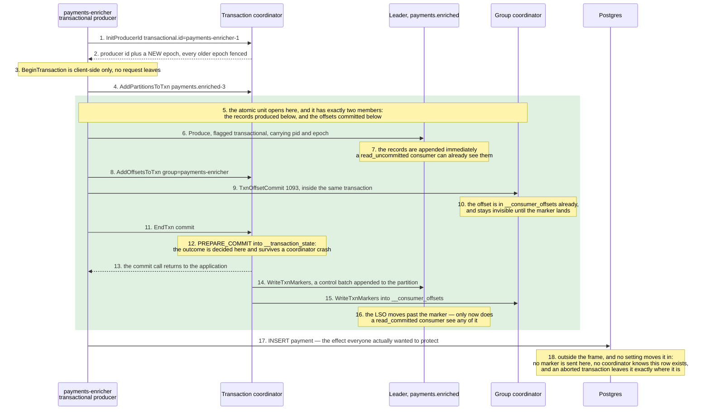

# 10 — Transactions and exactly-once: what the atomic unit really is

**The question:** a Kafka transaction makes a read-process-write loop atomic — atomic
across *what*, exactly, and where does that stop?

KR2 · no interactive twin: this one is a protocol, and the interesting part is which
requests go to which coordinator — a table reads better than an animation.

The read-process-write stage here is `payments-enricher`, a consumer group of its own next to
`payments-consumer`: two applications subscribed to `payments.main` under one group id would
split its partitions between them, and each event would reach only one of the two.
`payments.enriched` is an exp-10 topic, declared in that experiment's own directory rather than
in the catalog, and exp-10 runs the stage on its own input topic too, so the measurement never
shares a topic with the service.

*Fig. 10 — the frame is the transaction, and it has exactly two members: the output
records and the consumed offsets, which become visible together when the markers land. The
Postgres lane is drawn for the opposite reason — it is a participant that no arrow inside
the frame ever reaches, and that absence is the entire limit of exactly-once (exp-10).*

## What each step really is

The numbers are written in by hand, because steps 3, 7, 10, 12 and 16 are the ones that
matter and `autonumber` counts only arrows.

| # | What actually happens | What breaks if you get it wrong |
|---|---|---|
| 1–2 | The coordinator is the broker leading the `__transaction_state` partition that `transactional.id` hashes to — a **different** coordinator from the group's, reached by a different hash. Bumping the epoch fences every previous incarnation of that id and rolls back whatever it left open. | A `transactional.id` generated fresh on each start fences nothing and recovers nothing: it is a new producer every time, and the zombie it was supposed to fence keeps writing. The id must be stable across restarts for the same logical worker. |
| 3 | No network call. The transaction begins the moment the client says so. | Timing a "transaction start" in a trace and finding nothing on the wire. |
| 4 | Every partition has to be registered with the coordinator **before** the first record goes to it, so the coordinator knows where to send markers later. | Nothing, if you use a client. It is why the first produce to a new partition inside a transaction costs an extra round trip, which is where per-transaction overhead comes from. |
| 5 | The frame, and the only reason this file has a diagram rather than a paragraph: the atomic unit is a **set of Kafka partitions** — the ones records are produced to, plus the `__consumer_offsets` partition the offsets go to. Membership is decided by step 4, not by what the application considers one unit of work. | Reading "exactly-once" as a property of the processing loop. It is a property of that set, and everything outside the set is unaffected by the outcome — which is what steps 17–18 are for. |
| 6–7 | Transactional records are written into the log like any others, in place, immediately. There is no staging area. | "Uncommitted data is not in Kafka." It is. It is filtered on read, by the consumer, using the aborted-transaction index — which is why `read_uncommitted` sees aborted records forever. |
| 8–9 | The consumed offsets are committed **through the transaction**, to the group coordinator. That is the half people forget: without it the output is atomic and the input position is not, so a crash reprocesses and re-emits. | Calling the ordinary `CommitOffsets` next to a transaction. It commits outside the transaction, and the loop is at-least-once with extra steps. |
| 10 | The offset row is already written; the marker decides whether it counts. | Reading `__consumer_offsets` directly during a transaction and drawing conclusions from it. |
| 11–13 | `PREPARE_COMMIT` is the point of no return, and it is durable before the caller is told anything. The markers after it are cleanup that will happen eventually, even if the coordinator dies. | Treating a commit timeout as an abort. Same rule as [01](01-write-path.md) step 13: after the request is sent, the outcome is unknown, not failed. |
| 14–15 | A marker is a control batch, appended to each participating partition, never handed to application code. | Counting records with a raw log dump and finding more than you produced. |
| 16 | The LSO advances past the marker, and everything in the transaction becomes visible at once. | This is the lag people report as "messages are missing": a `read_committed` consumer is not behind, it is waiting for a marker that has not been written yet ([02](02-log-segments-retention.md), [03](03-read-path.md)). |
| 17–18 | The step that is drawn outside the frame on purpose. A row in Postgres is not a Kafka partition, so it cannot be a member of the set in step 5: no `AddPartitionsToTxn` can name it, no marker is written to it, and `EndTxn abort` leaves it untouched. | The single most expensive misreading of this feature. An aborted transaction discards the records and commits no offsets, and keeps the row — so the input is reprocessed, the row is written a second time, and the system is at-least-once exactly where it was assumed to be exactly-once (exp-10b). |

## The consumer is half of the guarantee

A transactional producer with a `read_uncommitted` consumer downstream provides
**nothing**: the consumer reads aborted records as if they were real. Exactly-once
read-process-write requires `isolation.level=read_committed`
(`kgo.FetchIsolationLevel(kgo.ReadCommitted())`) on every consumer of the output, and the
setting lives in a different service from the one that owns the transaction. That is a
deployment fact, not a code fact, and it is the most common way an EOS pipeline is
silently not one.

## One producer per group instance, not per partition

The pattern in older articles — a `transactional.id` per input partition — predates
KIP-447 (Kafka 2.5). Since then the consumer group metadata travels with the offset
commit, the group coordinator fences zombies by generation, and one transactional
producer per worker is enough. franz-go implements this flow as
`kgo.NewGroupTransactSession` plus `sess.Begin()` / `sess.End(ctx, kgo.TryCommit)`, and
it now always requires stable fetch offsets for group consumers, so a pending transaction
delays the offset fetch instead of handing back a position that a marker may still undo.
Copying the pre-2.5 recipe produces a producer per partition, a `transactional.id`
explosion, and a rebalance that fences the wrong things.

## What it costs

| Cost | Detail |
|---|---|
| latency | records are invisible until the markers land, so the pipeline's end-to-end latency has the transaction length added to it |
| a stalled LSO | one hung transaction pins the LSO of its partitions until `transaction.timeout.ms` expires, plus up to the coordinator's 10 s cleanup interval — exp-10d held an unrelated producer's records back for 23.2 s behind a 20 s timeout — franz-go's `TransactionTimeout` defaults to 40 s, Java's to 1 min, and the broker caps both at `transaction.max.timeout.ms`, 15 min. Symptom: `read_committed` consumers show lag while `read_uncommitted` consumers are fine |
| cluster state | `__transaction_state` needs `transaction.state.log.replication.factor=3` and `transaction.state.log.min.isr=2`, or transactions will not start on a three-broker lab and the error will not say so |
| the wrong reach | none of it extends past Kafka |

## Where it stops, and what replaces it

The moment the effect of processing is a row in Postgres, that row is not a participant
in the two-phase commit above. No marker reaches it, no coordinator knows it exists, and
`EndTxn` cannot roll it back. The guarantee ends at the process boundary drawn in
[06](06-transactional-outbox.md).

So for "Kafka plus Postgres" the answer is not EOS:

- on the way in, an **inbox** keyed by a stable event id makes redelivery a no-op
  ([05](05-delivery-semantics.md));
- on the way out, an **outbox** in the same database transaction as the state change
  ([06](06-transactional-outbox.md)).

Kafka transactions remain the right tool for the case they were built for: a
Kafka-to-Kafka read-process-write stage, where every participant is a partition. Reaching
for them to protect a database write is the single most expensive misreading of this
feature, because it looks like it works right up until the process dies in the wrong
millisecond.

## Measured

[journal](../00-journal.md#exp-10--what-a-kafka-transaction-covers-and-where-it-stops)

1 000 payments through a read-process-write loop, one transaction per batch of 50, the
processor killed with `SIGKILL` after producing a batch and before committing it. The
replacement presents the same transactional id, which is how the broker learns the old
transaction is dead and aborts it.

| Run | `read_committed` output | `read_uncommitted` output | Postgres | Log |
|---|---|---|---|---|
| exp-10a — rollback | **1 000, 1 000 distinct** | 1 050 | — | [run](../../experiments/transaction_guarantee/exp-10a-rollback/results/run-2026-09-21-185537.log) |
| exp-10b — database in the loop | **1 000, 1 000 distinct** | 1 050 | **1 050 rows, 50 duplicated** | [run](../../experiments/transaction_guarantee/exp-10b-database-boundary/results/run-2026-09-21-185649.log) |
| exp-10c — `read_uncommitted` | 1 000, 1 000 distinct | **1 050 — the aborted batch delivered** | — | [run](../../experiments/transaction_guarantee/exp-10c-read-uncommitted/results/run-2026-09-21-185751.log) |

**The transaction held exactly where it claims to and nowhere else.** The output records
of the killed batch were aborted and its consumed offsets, which join the transaction only
at its end, were never committed, so the replacement reprocessed the batch and a `read_committed` reader saw every payment once. The Postgres
rows written for the same batch did not roll back, because nothing told the database a
transaction existed — 50 payments recorded twice. That is exp-10b in one line: EOS is a
property of Kafka's partitions, and a database write inside the loop is outside it.

**The aborted records are in the log.** exp-10c read the same output with
`read_uncommitted` and was handed all 50 of them. A transaction does not stop records being
written; it stops `read_committed` readers being given them.

### exp-10d — a transaction left open — [run](../../experiments/transaction_guarantee/exp-10d-hanging-transaction/results/run-2026-09-21-190032.log)

| | |
|---|---|
| stuck producer | one record in a transaction, never ended, `TransactionTimeout` 20 s |
| unrelated producer | 100 records written after it, **no transaction at all** |
| high watermark / last stable offset | **101 / 0** — 101 records reported as lag, none deliverable |
| `read_uncommitted` saw the 100 after | **0 s** |
| `read_committed` saw them after | **23.2 s** |

An unrelated producer with no transaction was held back for the full life of someone
else's. The stall is not the timeout alone: the coordinator looks for expired transactions
every `transaction.abort.timed.out.transaction.cleanup.interval.ms`, 10 s by default
([read off the broker](../../experiments/transaction_guarantee/exp-10d-hanging-transaction/results/broker-transaction-timers.log)), so a
20 s timeout releases readers somewhere between 20 and 30 s — 23.2 s here. With
franz-go's default of 40 s that window is 40–50 s, and the broker lets a producer ask for
up to `transaction.max.timeout.ms`, 15 minutes.
